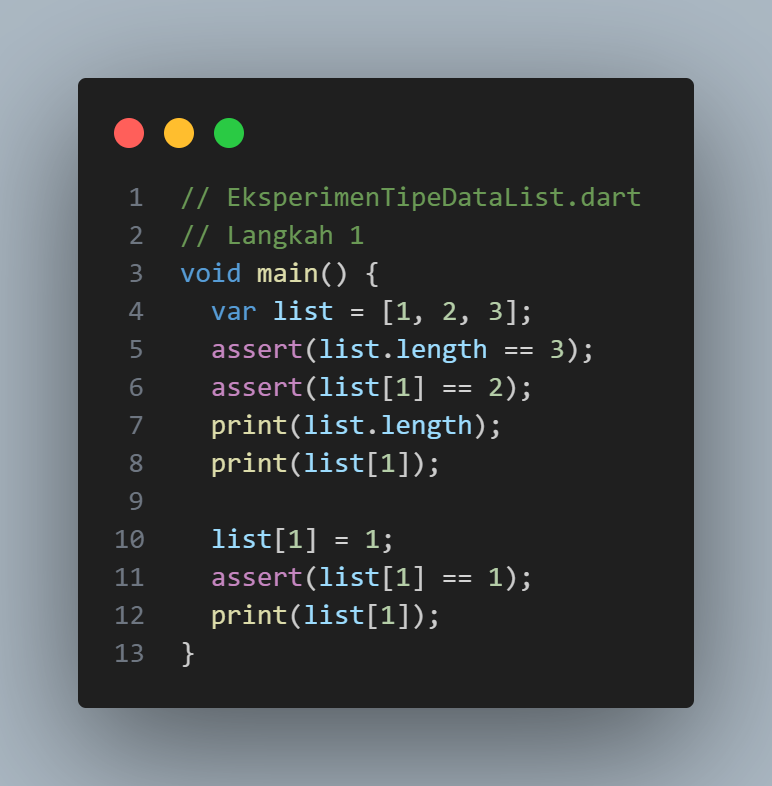
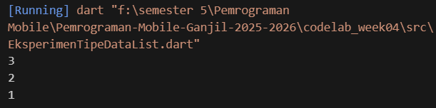
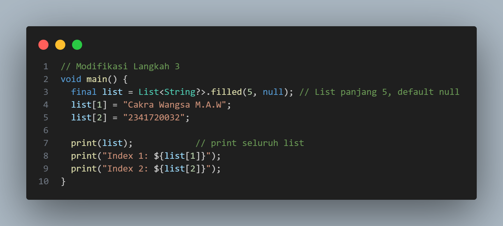
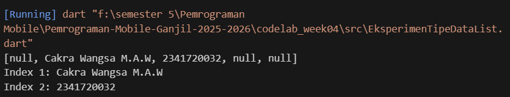

  

<h1 align="center">LAPORAN PRAKTIKUM</h1>
<h2 align="center">JOBSHEET 03</h2>
<h3 align="center">Pengantar Bahasa Pemrograman Dart - Bagian 2</h3>
<h3 align="center">Pengantar Dasar Dart-Bag.3 (Collections and Functions)</h3>

---

### **Dosen Pembimbing**
**Habibie Ed Dien, S.Kom., M.T.**

---

### **Disusun oleh**
**Nama**  : Cakra Wangsa M.A.W  
**NIM**   : 2341720032  
**Kelas** : TI-3G  
**Program Studi** : D-4 Teknik Informatika  

---

### **Alamat Kampus**
Politeknik Negeri Malang  
Jl. Soekarno Hatta No.9, Jatimulyo, Kec. Lowokwaru, Kota Malang, Jawa Timur 65141
**Phone** : (0341) 404424, 404425
**Email** : [Polinema.ac.id](https://www.polinema.ac.id)

---

# Praktikum 1: Eksperimen Tipe Data List

## Langkah 1
Ketik atau salin kode program berikut ke dalam `void main()`.

## Langkah 2
Silakan coba eksekusi (Run) kode pada langkah 1 tersebut. Apa yang terjadi? Jelaskan!

Kode berhasil dijalankan tanpa error karena list bertipe `List<int>` yang bersifat mutable, sehingga elemen dapat diubah tanpa mengganti objek list. Semua `assert` terpenuhi dan tidak ada pelanggaran tipe data, sehingga program berjalan normal dengan output:

## Langkah 3
Ubah kode pada langkah 1 menjadi variabel `final` yang mempunyai `index = 5` dengan default value = `null`. Isilah nama dan NIM Anda pada elemen `index` ke-1 dan ke-2. Lalu print dan capture hasilnya.

Apa yang terjadi? Jika terjadi error, silakan perbaiki.

**Jawab:**  
Kode pada langkah 3 berhasil dijalankan tanpa error karena `final` hanya membuat referensi list tidak bisa diarahkan ke list lain, tetapi elemen di dalamnya tetap dapat diubah (mutable). Dengan `List<String?>.filled(5, null)` dibuat list sepanjang 5 dengan nilai awal `null`, kemudian `list[1]` diisi dengan nama dan `list[2]` diisi dengan NIM.

**Kode Program:**

**Output:**

