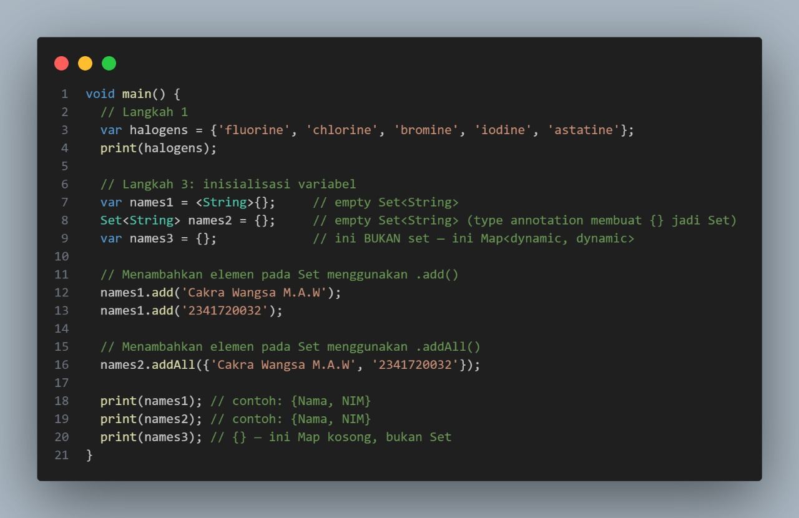

<p align="center">
  
</p>

<h1 align="center">LAPORAN PRAKTIKUM</h1>
<h2 align="center">JOBSHEET 04</h2>
<h3 align="center">MINGGU 4</h3>
<h4 align="center">Pengantar Dasar Dart-Bag.3 (Collections and Functions)</h4>

---

<div align="center">

### **Dosen Pembimbing**
**Habibie Ed Dien, S.Kom., M.T.**

---

### **Disusun oleh**
**Nama**  : Cakra Wangsa M.A.W  
**NIM**   : 2341720032  
**Kelas** : TI-3G  
**Program Studi** : D-4 Teknik Informatika  

---

### **Alamat Kampus**
Politeknik Negeri Malang  
Jl. Soekarno Hatta No.9, Jatimulyo, Kec. Lowokwaru, Kota Malang, Jawa Timur 65141
**Phone** : (0341) 404424, 404425
**Email** : [Polinema.ac.id](https://www.polinema.ac.id)

</div>

---

# Praktikum 1: Eksperimen Tipe Data List

## Langkah 1
Ketik atau salin kode program berikut ke dalam `void main()`.


## Langkah 2
Silakan coba eksekusi (Run) kode pada langkah 1 tersebut. Apa yang terjadi? Jelaskan!

Kode berhasil dijalankan tanpa error karena list bertipe `List<int>` yang bersifat mutable, sehingga elemen dapat diubah tanpa mengganti objek list. Semua `assert` terpenuhi dan tidak ada pelanggaran tipe data, sehingga program berjalan normal dengan output:


## Langkah 3
Ubah kode pada langkah 1 menjadi variabel `final` yang mempunyai `index = 5` dengan default value = `null`. Isilah nama dan NIM Anda pada elemen `index` ke-1 dan ke-2. Lalu print dan capture hasilnya.

Apa yang terjadi? Jika terjadi error, silakan perbaiki.

**Jawab:**
Kode pada langkah 3 berhasil dijalankan tanpa error karena `final` hanya membuat referensi list tidak bisa diarahkan ke list lain, tetapi elemen di dalamnya tetap dapat diubah (mutable). Dengan `List<String?>.filled(5, null)` dibuat list sepanjang 5 dengan nilai awal `null`, kemudian `list[1]` diisi dengan nama dan `list[2]` diisi dengan NIM.

**Kode Program:**


**Output:**


---

# Praktikum 2: Eksperimen Tipe Data Set

## Langkah 1
Ketik atau salin kode program berikut ke dalam fungsi `main()`.

### Kode Program


### Output


---

## Langkah 2
Silakan coba eksekusi (Run) kode pada langkah 1 tersebut. Apa yang terjadi? Jelaskan! Lalu perbaiki jika terjadi error.

**Jawab:**
Pada kode program akan menampilkan isi set tanpa error karena semua elemennya unik dan bertipe String. Set digunakan untuk menyimpan data yang tidak boleh duplikat, urutan elemen akan mengikuti urutan saat dimasukkan, dan proses pengecekan anggotanya cepat. Dan pada tanda `{}` kosong akan dianggap sebagai Map, jadi untuk membuat set kosong harus ditulis dengan `<T>{}` atau `Set<T>()`.

---

## Langkah 3
Tambahkan kode program berikut, lalu coba eksekusi (Run) kode Anda.

**Jawab:**

### Kode Program


### Output


Jika kode program tidak diberikan tambahan. Pada kode program akan menghasilkan output, di baris pertama akan menampilkan daftar unsur halogen karena Dart mengenalinya sebagai Set berisi string. Dua variabel berikutnya (`names1` dan `names2`) juga adalah `Set<String>` kosong, sehingga saat dicetak terlihat `{}`. Namun, variabel terakhir (`names3`) dibuat dengan `{}` tanpa tipe, sehingga Dart menganggapnya sebagai Map kosong, bukan Set. Meskipun memiliki tampilan yang sama pada output, tipe datanya berbeda, sehingga cara penggunaannya di program juga akan berbeda.

---

### Kode Program (Setelah Perbaikan)


### Output


Namun jika kode program diberikan perbaikan pada langkah ini dengan tiga variabel: `names1 = <String>{}` dan `names2 = {}` yang adalah Set kosong, sedangkan `names3 = {}` sebenarnya Map kosong. Maka isi pada `names1` dengan nama dan NIM menggunakan `.add()` satu per satu, dan `names2` menggunakan `.addAll()` sekaligus. Saat dijalankan, keduanya menampilkan isi Set sesuai urutan yang ditambahkan, sedangkan `names3` tetap `{}` karena Map kosong.

---

# Praktikum 3: Eksperimen Tipe Data Maps

## Langkah 1
Ketik atau salin kode program berikut ke dalam fungsi `main()`.

**Jawab:**

### Kode Program


### Output


---

## Langkah 2
Silakan coba eksekusi (Run) kode pada langkah 1 tersebut. Apa yang terjadi? Jelaskan! Lalu perbaiki jika terjadi error.

**Jawab:**


Kode program menghasilkan output yang menunjukkan bahwa **Map** berhasil dibuat dan dicetak tanpa error karena format deklarasi benar.
Dikarenakan **Map** menyimpan data dalam bentuk pasangan key–value, di mana setiap key harus unik.
Data dapat diakses, ditambahkan, atau diubah menggunakan key-nya.

---

## Langkah 3
Tambahkan kode program berikut, lalu coba eksekusi (Run) kode Anda.

**Jawab:**

### Kode Program


### Output


Sebelumnya kode program membuat dua `Map`: `gifts` (kunci `String`) dan `nobleGases` (kunci `int`).
Awalnya, keduanya berisi campuran nilai `String` dan `int`. Tetapi setelah menambahkan kode, maka akan mengubah nilai tertentu:
`gifts['fifth']` dari `1` menjadi `'golden rings'`, dan `nobleGases[18]` dari `2` menjadi `'argon'`.
Hasil akhirnya, kedua `Map` berisi nilai `String` semua, dan perubahan langsung terlihat saat dicetak ulang.

---

### Menambahkan elemen nama dan NIM Anda pada tiap variabel

### Kode Program


### Output


Setelah program diberikan tambahan maka akan membuat dan menampilkan beberapa **Map** di Dart.
Pertama, `gifts` berisi pasangan kunci–nilai dengan kunci bertipe `String`, sedangkan `nobleGases` berisi kunci bertipe `int`.
Keduanya langsung diisi data, lalu dicetak.

Setelah itu dibuat `mhs1` (Map dengan kunci dan nilai `String`) yang diisi data nama dan NIM, serta `mhs2` (Map dengan kunci `int` dan nilai `String`) yang juga diisi data yang sama.
Semua Map tersebut kemudian dicetak, sehingga terlihat isi masing-masing sesuai tipe dan data yang dimasukkan.

---

# Praktikum 4: Eksperimen Tipe Data List: Spread dan Control-flow Operators

## Langkah 1
Ketik atau salin kode program berikut ke dalam fungsi `main()`.

**Jawab:**


## Langkah 2
Silakan coba eksekusi (Run) kode pada langkah 1 tersebut. Apa yang terjadi? Jelaskan! Lalu perbaiki jika terjadi error.

**Jawab:**


Output kode program akan mengalami error dikarenakan pada variabel `list1` tidak dideklarasikan, sehingga Dart tidak dapat mengenali variabel tersebut.

**Perbaikan dan Output Kode**


## Langkah 3
Tambahkan kode program berikut, lalu coba eksekusi (Run) kode Anda.  
Apa yang terjadi? Jika terjadi error, silakan perbaiki.

**Jawab:**

Output kode akan mengalami error karena `list1` otomatis akan dianggap bertipe `List<int>` (hanya boleh berisi angka), sehingga saat menambahkan `null`, Dart menolak karena tipe `int` tidak mengizinkan nilai kosong (`null`) tanpa adanya tanda tanya `?`.

**Kode Program**


**Output**


---

**Perbaikan Kode**

Pada kode ini akan membuat dan memodifikasi list yang dapat berisi nilai `null`, lalu menggunakan spread `(...)` dan null-aware spread `(...?)` untuk menggabungkannya ke list baru agar tidak terjadi error.

**Kode Program**


**Output**


---

Tambahkan variabel list berisi NIM Anda menggunakan Spread Operators. Dokumentasikan hasilnya dan buat laporannya!

**Kode Program**


**Output**


## Langkah 4
Tambahkan kode program berikut, lalu coba eksekusi (Run) kode Anda.  
Apa yang terjadi? Jika terjadi error, silakan perbaiki.  
Tunjukkan hasilnya jika variabel `promoActive` ketika `true` dan `false`.

**Kode Dan Output Program**


Kode akan mengalami error dikarenakan pada variabel `promoActive` belum pernah dibuat atau dideklarasikan sebelumnya, sehingga Dart tidak mengenalinya saat kode dijalankan.

---

**Perbaikan Kode**

**Kode Program**


**Output**


## Langkah 5
Tambahkan kode program berikut, lalu coba eksekusi (Run) kode Anda.  
Apa yang terjadi? Jika terjadi error, silakan perbaiki.  
Tunjukkan hasilnya jika variabel `login` mempunyai kondisi lain.

**Kode dan Output Program**


Output akan mengalami error karena variabel `login` belum pernah dideklarasikan dan penulisan `if (login case 'Manager')` tidak sesuai sintaks Dart, sehingga program tidak tahu nilai yang dicek dan cara membandingkannya.

---

### Perbaikan Kode dengan variabel `login` mempunyai kondisi lain
Pada perbaikan kode akan menampilkan daftar menu navigasi (`nav2`) yang isinya menyesuaikan peran pengguna (`login`):  
- Semua peran mendapat menu dasar *Home*, *Furniture*, dan *Plants*  
- **Manager** mendapat tambahan *Inventory* dan *Reports*  
- **Admin** mendapat *Dashboard* dan *Reports*  
- **Staff** hanya mendapat *Reports*  
- `null` atau *Guest* hanya melihat menu dasar  


**Output**


## Langkah 6
Tambahkan kode program berikut, lalu coba eksekusi (Run) kode Anda.

**Kode dan Output Program**


Kode tersebut membuat `listOfInts` berisi `[1, 2, 3]`, lalu membentuk `listOfStrings` yang diawali `'#0'` dan dilanjutkan dengan `'#1'`, `'#2'`, `'#3'` melalui **Collection For** dari `listOfInts`; pernyataan `assert` memverifikasi bahwa elemen indeks ke-1 adalah `'#1'` sehingga program berjalan tanpa error.

### Manfaat Collection For
- Menulis loop langsung di dalam literal list/set/map.
- Lebih ringkas dan mudah dibaca dibanding membuat list kosong lalu `.add()` satu per satu.
- Bisa digabung dengan `if` untuk filter data saat membentuk koleksi.

---

# Praktikum 5: Eksperimen Tipe Data Records

## Langkah 1
Ketik atau salin kode program berikut ke dalam fungsi `main()`.

**Kode Program**


## Langkah 2
Silakan coba eksekusi (Run) kode pada langkah 1 tersebut. Apa yang terjadi? Jelaskan! Lalu perbaiki jika terjadi error.


**Jawab:**  
Pada output menampilkan berupa `record` yang menyimpan data campuran dalam satu variabel menggunakan **Record** Dart: dua *positional field* (`'first'`, `'last'`) dan dua *named field* (`a: 2`, `b: true`). Saat `print(record)` dijalankan, tampil `('first', a: 2, b: true, 'last')`. Struktur ini menggabungkan sifat list (urutan) dan map (nama field) sehingga praktis untuk menyimpan dan mengakses berbagai tipe data secara terstruktur tanpa membuat kelas khusus.

## Langkah 3
Tambahkan kode program berikut di luar scope `void main()`, lalu coba eksekusi (Run) kode Anda.

**Kode Program**


**Output**


Kode akan mengeluarkan output record `(33, 66)` lalu mencetaknya sebagai kondisi awal. Fungsi `tukar()` menerima record tersebut, memecahnya menjadi variabel `a` dan `b`, kemudian mengembalikan record baru dengan urutan nilai dibalik menjadi `(b, a)`. Hasilnya, output menunjukkan proses pertukaran nilai field di dalam record secara jelas: sebelum `(33, 66)` dan sesudah `(66, 33)`.

## Langkah 4
Tambahkan kode program berikut di dalam scope `void main()`, lalu coba eksekusi (Run) kode Anda.


**Jawab:**  
Error pada kode program disebabkan karena di Dart, variabel dengan tipe non-nullable (seperti `(String, int) mahasiswa`) wajib diberi nilai awal sebelum digunakan. Tetapi pada kode, `mahasiswa` langsung dipanggil di `print()` tanpa diinisialisasi, sehingga Dart menghentikan eksekusi dan menampilkan pesan kesalahan.

### Perbaikan Kode

**Kode dan Output Program**


## Langkah 5
Tambahkan kode program berikut di dalam scope `void main()`, lalu coba eksekusi (Run) kode Anda.


Tidak ada error di sini, tapi diminta mengganti salah satu field dengan nama dan NIM.

---

**Penambahan Kode**

**Kode dan Output Program**


# Tugas Praktikum
1. Silakan selesaikan Praktikum 1 sampai 5, lalu dokumentasikan berupa screenshot hasil pekerjaan Anda beserta penjelasannya!

Jawab: Sudah Selesai Semua

2. Jelaskan yang dimaksud Functions dalam bahasa Dart!
   
   Jawab: Function adalah sebuah blok kode yang dapat dilakukan pemanggilan berulang-ulang untuk dapat menjalankan tugas tertentu. Dengan penggunaan Function kode menjadi lebih terstruktur, mudah dibaca, dan mudah digunakan kembali (reusable).

3. Jelaskan jenis-jenis parameter di Functions beserta contoh sintaksnya!

   Jawab:

   ### Jenis-Jenis Parameter di Functions

    **Positional Parameters**
    **Definisi:** Parameter yang urutannya wajib sesuai saat memanggil fungsi.
    **Ciri:** Tidak diberi tanda khusus, dan semua harus diisi sesuai urutan.
    **Contoh sintaks:**
    ```dart
    main () {
      void greet(String nama, String masadepan, int umur) {
        print('Hai aku $nama, dari masadepan $masadepan, umurku $umur tahun');
      }
      greet('Sore','untuk membantumu coding!', 21);
    }

    **Optional Positional Parameters**
    **Definisi:** Parameter yang posisinya tetap, tapi sifatnya opsional (boleh tidak diisi).
    **Ciri:**Ditulis di dalam tanda [], bisa diberi nilai default..
    **Contoh sintaks:**

    ```dart
    main () {
      void sayHello(String nama, [String? pesan]) {
        print('Halo $nama, ${pesan ?? "tidak ada pesan"}');
      }
      sayHello('Cakra');
      sayHello('Cakra', 'Semangat!');
    }
    ```
    **Named Parameters**
    **Definisi:** Parameter yang dipanggil berdasarkan nama, bukan urutan.
    **Ciri:**Ditulis di dalam tanda {}, dan saat memanggil fungsi harus menyebutkan nama parameternya.
    **Contoh sintaks:**

    ```dart
    main () {
    void buatProfil({required String nama, int Kelas = 0}) {
      print('Nama: $nama, Kelas: $Kelas');
    }
    buatProfil(nama: 'Cakra', Kelas: 3);
    }
    ```

4. Jelaskan maksud Functions sebagai first-class objects beserta contoh sintaknya!

   jawab: function di Dart yang bisa diperlakukan seperti nilai: bisa disimpan dalam variabel, bisa dikirim sebagai parameter ke function lain, bahkan bisa dikembalikan dari function.

  ```dart
  void halo(String nama) => print("Halo $nama");

  // Fungsi yang menerima fungsi lain sebagai parameter
  void jalankan(void Function(String) fungsi, String value) {
    fungsi(value);
  }

  // Fungsi yang mengembalikan fungsi lain
  Function buatPenyapa(String sapaan) {
    return (String nama) => print("$sapaan, $nama!");
  }

  void main() {
    // Simpan fungsi dalam variabel
    var f = halo;
    f("Sore");

    // Kirim fungsi sebagai parameter
    jalankan(halo, "Gunawan");

    // Gunakan fungsi anonim langsung
    jalankan((nama) => print("Selamat datang $nama"), "Cakra");

    // Simpan fungsi hasil dari fungsi lain
    var penyapaPagi = buatPenyapa("Selamat pagi");
    penyapaPagi("Slamet");

    var penyapaMalam = buatPenyapa("Selamat malam");
    penyapaMalam("Basuki");
  }
  ```

5. Apa itu Anonymous Functions? Jelaskan dan berikan contohnya!

   Jawab: Anonymous Function adalah function tanpa nama, yang digunakan untuk function kecil untuk dipakai satu kali, dan sering digunakan pada callback.

  ```dart
  void main() {
  var angka = [1, 2, 3];
  angka.forEach((n) {
    print('Angka: $n');
    });
  }
  ```
   
6. Jelaskan perbedaan Lexical scope dan Lexical closures! Berikan contohnya!

   Jawab:

   a. Lexical Scope memiliki aturan yang sebagaimana variabel diakses berdasarkan lokasi kode.

   ```dart
    void main() {
    var x = 10;
    void tampilX() {
      print(x); // x bisa diakses karena ada di scope luar
    }
      tampilX();
    }
   ```

   b.Lexical Closure adalah sebuah function yang mengikat variabel dari scope luar, dan bisa menyimpannya bahkan setelah scope luar selesai dieksekusi.

  ```dart
  Function counter() {
  var hitung = 0;
  return () {
    hitung++;
    print(hitung);
    };
  }

  void main() {
    var tambah = counter();
    tambah(); // 1
    tambah(); // 2 -> variabel hitung tetap tersimpan
  }
  ```

7. Jelaskan dengan contoh cara membuat return multiple value di Functions!

   Jawab: pemrograman, return multiple value berarti sebuah fungsi mengembalikan lebih dari satu hasil sekaligus. Konsep ini biasanya dilakukan dengan mengemas nilai-nilai tersebut ke dalam satu wadah seperti tuple, list, atau dictionary

   ```dart
      (String, int, List<String>) profilLengkap() {
      String nama = 'Cakra Wangsa M.A.W';
      int umur = 21;
      List<String> hobi = ['Coding', 'Gaming', 'Membaca'];
      return (nama, umur, hobi);
    }

    void main() {
      // Destructuring record
      var (nama, umur, hobi) = profilLengkap();
      print('=== PROFIL ===');
      print('Nama : $nama');
      print('Umur : $umur tahun');
      print('Hobi : ${hobi.join(", ")}');
      if (umur >= 18) {
        print('Status: Dewasa');
      } else {
        print('Status: Belum Dewasa');
      }
    }
   ```

8. Kumpulkan berupa link commit repo GitHub pada tautan yang telah disediakan di grup Telegram!

   Jawab:

