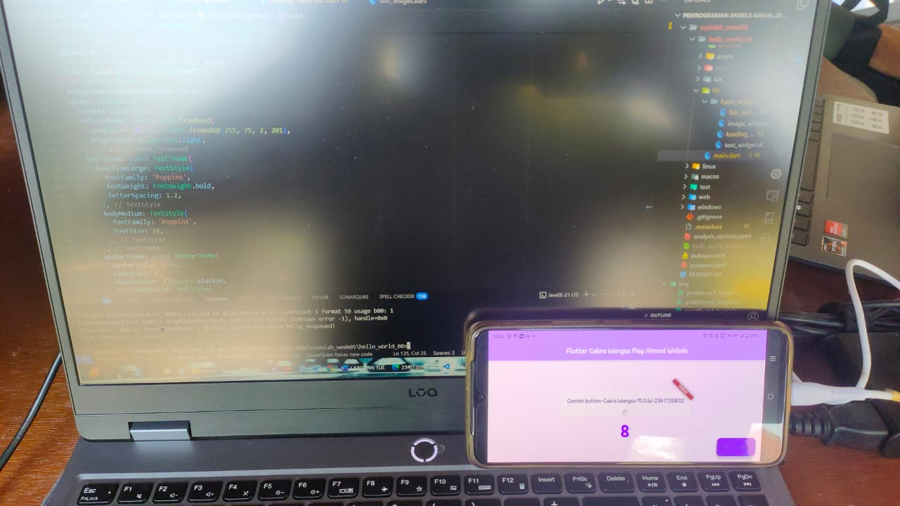
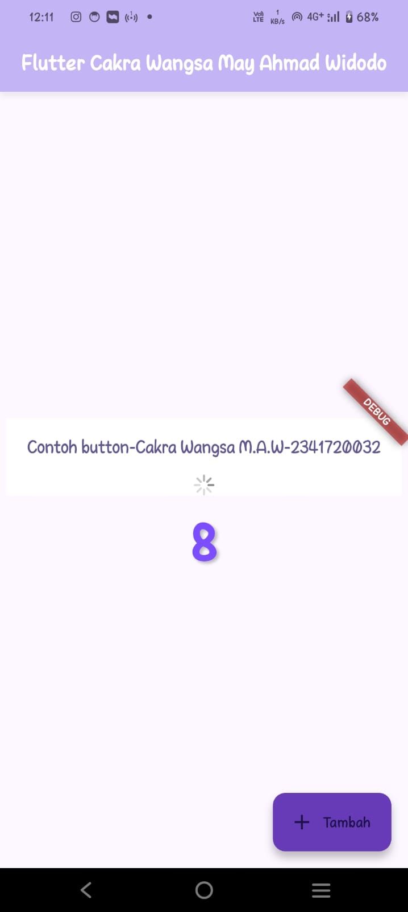

<p align="center">
  
</p>

<h1 align="center">LAPORAN PRAKTIKUM</h1>
<h2 align="center">JOBSHEET 05</h2>
<h3 align="center">Aplikasi Pertama dan Widget Dasar Flutter</h3>

---

<div align="center">

### **Dosen Pembimbing**
**Habibie Ed Dien, S.Kom., M.T.**

---

### **Disusun oleh**
**Nama**  : Cakra Wangsa M.A.W


**NIM**   : 2341720032


**Kelas** : TI-3G


**Program Studi** : D-4 Teknik Informatika

---

### **Alamat Kampus**
Politeknik Negeri Malang
Jl. Soekarno Hatta No.9, Jatimulyo, Kec. Lowokwaru, Kota Malang, Jawa Timur 65141
**Phone** : (0341) 404424, 404425
**Email** : [Polinema.ac.id](https://www.polinema.ac.id)

</div>

---

# Praktikum Mobile Programming - Week 05

## Praktikum 1: Membuat Project Flutter Baru

Selesaikan langkah-langkah praktikum berikut ini menggunakan editor Visual Studio Code (VS Code), Android Studio, atau code editor lain kesukaan Anda.

### Langkah 4
Jika sudah selesai proses pembuatan project baru, pastikan tampilan seperti berikut.
Pesan akan tampil berupa **"Your Flutter Project is ready!"** yang artinya Anda telah berhasil membuat project Flutter baru.


---

## Praktikum 2: Menghubungkan Perangkat Android atau Emulator

Melanjutkan dari praktikum 1, Anda diminta untuk menjalankan aplikasi ke perangkat fisik (device Android atau iOS).
Silakan ikuti langkah-langkah pada codelab berikut:

[Basic Android Kotlin Compose - Connect Device](https://developer.android.com/codelabs/basic-android-kotlin-compose-connect-device?hl=id#0)

### Memilih device, menggunakan perangkat fisik (Realme 5 PRO):


### Gambar Pembuktian sudah tersambung handphone



### Hasil run dari android



---

## Praktikum 3: Membuat Repository GitHub dan Laporan Praktikum

Melanjutkan dari praktikum 2, silakan selesaikan langkah-langkah berikut ini.

> **Perhatian:** Diasumsikan Anda telah mempunyai akun GitHub dan Anda telah memahami konsep dasar dalam bekerja menggunakan Git pada pertemuan pertama.

Praktikum ini dapat Anda lewati langsung ke **Langkah 11** jika sudah paham cara membuat laporan praktikum sesuai style yang Anda pilih.

### Langkah 11
Kembali ke VS Code, ubah platform di pojok kanan bawah ke emulator, device, atau browser Chrome.
Lalu coba jalankan project `hello_world` dengan menekan **F5** atau melalui menu **Run > Start Debugging**.
Tunggu proses kompilasi hingga selesai, maka aplikasi Flutter pertama Anda akan tampil seperti berikut.


> **Perhatian:** Proses Run atau kompilasi untuk pertama kali akan memakan waktu cukup lama (3-5 menit).
> Proses kompilasi berikutnya akan lebih cepat.
> Berbeda ketika melakukan kompilasi ke device, proses ini akan memakan waktu lebih lama.

### Langkah 12
Silakan lakukan screenshot seperti pada Langkah 11, namun teks yang ditampilkan dalam aplikasi berupa **nama lengkap Anda**.
Simpan file screenshot dengan nama **01.png** pada folder `images` (buat folder baru jika belum ada) di project `hello_world`.

Lalu ubah isi `README.md` seperti berikut agar menampilkan hasil screenshot pada file `README.md`.
Kemudian lakukan **push** ke repository Anda.


> **Perhatian:** Lakukan proses screenshot seperti pada Langkah 12 untuk setiap Laporan Praktikum yang akan Anda buat pada praktikum selanjutnya hingga pertemuan project final.

---

# Praktikum 4: Menerapkan Widget Dasar

## Selesaikan langkah-langkah praktikum berikut ini dengan melanjutkan dari praktikum sebelumnya.

---

### Langkah 1: Text Widget

Buat folder baru `basic_widgets` di dalam folder `lib`.
Kemudian buat file baru di dalam `basic_widgets` dengan nama `text_widget.dart`.
Ketik atau salin kode program berikut ke project `hello_world` Anda pada file `text_widget.dart`.

> **Perhatian:** Gantilah teks **Fulan** dengan **nama lengkap Anda**.

#### Kode Program

```dart
import 'package:flutter/material.dart';

class MyTextWidget extends StatelessWidget {
  const MyTextWidget({Key? key}) : super(key: key);

  @override
  Widget build(BuildContext context) {
    return const Text(
      "Nama saya Cakra Wangsa M.A.W, sedang belajar Pemrograman Mobile",
      style: TextStyle(color: Colors.red, fontSize: 14),
      textAlign: TextAlign.center,
    );
  }
}
```

#### Output


---

### Langkah 2: Image Widget
Buat sebuah file image_widget.dart di dalam folder basic_widgets dengan isi kode berikut.

#### Kode Program

```dart
import 'package:flutter/material.dart';

class MyImageWidget extends StatelessWidget {
  const MyImageWidget({Key? key}) : super(key: key);

  @override
  Widget build(BuildContext context) {
    return const Image(
      image: AssetImage("assets/Logo-Politeknik-Negeri-Malang.png"),
      width: 400,
      height: 400,
      fit: BoxFit.cover,
    );
  }
}
```
---

Lakukan penyesuaian asset pada file pubspec.yaml dan tambahkan file logo Anda di folder assets project hello_world.

```dart
flutter:
  # The following line ensures that the Material Icons font is
  # included with your application, so that you can use the icons in
  # the material Icons class.
  uses-material-design: true

  assets:
    - assets/
```
---

Jangan lupa sesuaikan kode dan import di file main.dart kemudian akan tampil gambar seperti berikut.

#### Output


---

## Praktikum 5: Menerapkan Widget Material Design dan iOS Cupertino

Selesaikan langkah-langkah praktikum berikut ini dengan melanjutkan project hello_world Anda. Lakukan langkah yang sama seperti pada Praktikum 3, yaitu setiap widget dibuat file sendiri lalu import ke main.dart dan screenshot hasilnya.

### Langkah 1: Cupertino Button dan Loading Bar
Buat file di basic_widgets > loading_cupertino.dart. Import stateless widget dari material dan cupertino. Lalu isi kode di dalam method Widget build adalah sebagai berikut.

```dart
import 'package:flutter/material.dart';
import 'package:flutter/cupertino.dart';

class LoadingCupertino extends StatelessWidget {
  const LoadingCupertino({Key? key}) : super(key: key);

  @override
  Widget build(BuildContext context) {
    return MaterialApp(
      home: Container(
        margin: const EdgeInsets.only(top: 30),
        color: Colors.white,
        child: Column(
          children: <Widget>[
            CupertinoButton(
              child: const Text("Contoh button"),
              onPressed: () {},
            ),
            const CupertinoActivityIndicator(),
          ],
        ),
      ),
    );
  }
}
```

### Langkah 2: Floating Action Button (FAB)
Button widget terdapat beberapa macam pada flutter yaitu ButtonBar, DropdownButton, TextButton, FloatingActionButton, IconButton, OutlineButton, PopupMenuButton, dan ElevatedButton.

Buat file di basic_widgets > fab_widget.dart. Import stateless widget dari material. Lalu isi kode di dalam method Widget build adalah sebagai berikut.

```dart
import 'package:flutter/material.dart';

class FabWidget extends StatelessWidget {
  const FabWidget({super.key});

  @override
  Widget build(BuildContext context) {
    return MaterialApp(
      home: Scaffold(
        floatingActionButton: FloatingActionButton(
          onPressed: () {
            // Add your onPressed code here!
          },
          child: const Icon(Icons.thumb_up),
          backgroundColor: Colors.pink,
        ),
      ),
    );
  }
}
```

### Langkah 3: Scaffold Widget
Scaffold widget digunakan untuk mengatur tata letak sesuai dengan material design.
Ubah isi kode main.dart seperti berikut.

```dart
// SCAFFOLD WIDGET
import 'package:flutter/material.dart';

void main() {
  runApp(const MyApp());
}

class MyApp extends StatelessWidget {
  const MyApp({Key? key}) : super(key: key);

  @override
  Widget build(BuildContext context) {
    return const MaterialApp(
      home: Scaffold(
        body: MyLayout(),
      ),
    );
  }
}

class MyLayout extends StatelessWidget {
  const MyLayout({Key? key}) : super(key: key);

  @override
  Widget build(BuildContext context) {
    return Padding(
      padding: const EdgeInsets.all(8.0),
      child: ElevatedButton(
        child: const Text('Show alert'),
        onPressed: () {
          showAlertDialog(context);
        },
      ),
    );
  }
}

showAlertDialog(BuildContext context) {
  Widget okButton = TextButton(
    child: const Text("OK"),
    onPressed: () {
      Navigator.pop(context);
    },
  );

  AlertDialog alert = AlertDialog(
    title: const Text("My title"),
    content: const Text("This is my message."),
    actions: [
      okButton,
    ],
  );

  showDialog(
    context: context,
    builder: (BuildContext context) {
      return alert;
    },
  );
}
```

# Praktikum 5: Menerapkan Widget Material Design dan iOS Cupertino

Selesaikan langkah-langkah praktikum berikut ini dengan melanjutkan project hello_world Anda. Lakukan langkah yang sama seperti pada Praktikum 3, yaitu setiap widget dibuat file sendiri lalu import ke main.dart dan screenshot hasilnya.

## Langkah 1: Cupertino Button dan Loading Bar
Buat file di basic_widgets > loading_cupertino.dart. Import stateless widget dari material dan cupertino. Lalu isi kode di dalam method Widget build adalah sebagai berikut.

### Kode Program

```dart
import 'package:flutter/material.dart';
import 'package:flutter/cupertino.dart';

class LoadingCupertino extends StatelessWidget {
  const LoadingCupertino({Key? key}) : super(key: key);

  @override
  Widget build(BuildContext context) {
    return MaterialApp(
      home: Container(
        margin: const EdgeInsets.only(top: 30),
        color: Colors.white,
        child: Column(
          children: <Widget>[
            CupertinoButton(
              child: const Text("Contoh button"),
              onPressed: () {},
            ),
            const CupertinoActivityIndicator(),
          ],
        ),
      ),
    );
  }
}
```

## Output


### Langkah 2: Floating Action Button (FAB)
Button widget terdapat beberapa macam pada flutter yaitu ButtonBar, DropdownButton, TextButton, FloatingActionButton, IconButton, OutlineButton, PopupMenuButton, dan ElevatedButton.

Buat file di basic_widgets > fab_widget.dart. Import stateless widget dari material. Lalu isi kode di dalam method Widget build adalah sebagai berikut.

```dart
import 'package:flutter/material.dart';

class FabWidget extends StatelessWidget {
  const FabWidget({super.key});

  @override
  Widget build(BuildContext context) {
    return MaterialApp(
      home: Scaffold(
        floatingActionButton: FloatingActionButton(
          onPressed: () {
            // Add your onPressed code here!
          },
          child: const Icon(Icons.thumb_up),
          backgroundColor: Colors.pink,
        ),
      ),
    );
  }
}
```

### Output


## Langkah 3: Scaffold Widget

Scaffold widget digunakan untuk mengatur tata letak sesuai dengan material design.

Ubah isi kode main.dart seperti berikut.

### Kode Program

```dart
// Langkah 3 Praktikum 5 week 05

import 'package:flutter/material.dart';

void main() {
  runApp(const MyApp());
}

class MyApp extends StatelessWidget {
  const MyApp({Key? key}) : super(key: key);

  // This widget is the root of your application.
  @override
  Widget build(BuildContext context) {
    return MaterialApp(
      title: 'Flutter Demo',
      theme: ThemeData(
        primarySwatch: Colors.red,
      ),
      home: const MyHomePage(title: 'My Increment App'),
    );
  }
}

class MyHomePage extends StatefulWidget {
  const MyHomePage({Key? key, required this.title}) : super(key: key);

  final String title;

  @override
  State<MyHomePage> createState() => _MyHomePageState();
}

class _MyHomePageState extends State<MyHomePage> {
  int _counter = 0;

  void _incrementCounter() {
    setState(() {
      _counter++;
    });
  }

  @override
  Widget build(BuildContext context) {
    return Scaffold(
      appBar: AppBar(
        title: Text(widget.title),
      ),
      body: Center(
        child: Column(
          mainAxisAlignment: MainAxisAlignment.center,
          children: <Widget>[
            const Text(
              'You have pushed the button this many times:',
            ),
            Text(
              '$_counter',
              style: Theme.of(context).textTheme.headlineLarge,
            ),
          ],
        ),
      ),
      bottomNavigationBar: BottomAppBar(
        child: Container(
          height: 50.0,
        ),
      ),
      floatingActionButton: FloatingActionButton(
        onPressed: _incrementCounter,
        tooltip: 'Increment Counter',
        child: const Icon(Icons.add),
      ),
      floatingActionButtonLocation: FloatingActionButtonLocation.centerDocked,
    );
  }
}
```

### Output


## Langkah 4: Dialog Widget

Dialog widget pada flutter memiliki dua jenis dialog yaitu AlertDialog dan SimpleDialog.

Ubah isi kode main.dart seperti berikut.

### Kode Program

```dart
class MyApp extends StatelessWidget {
  const MyApp({Key? key}) : super(key: key);

  @override
  Widget build(BuildContext context) {
    return const MaterialApp(
      home: Scaffold(
        body: MyLayout(),
      ),
    );
  }
}

class MyLayout extends StatelessWidget {
  const MyLayout({Key? key}) : super(key: key);

  @override
  Widget build(BuildContext context) {
    return Padding(
      padding: const EdgeInsets.all(8.0),
      child: ElevatedButton(
        child: const Text('Show alert'),
        onPressed: () {
          showAlertDialog(context);
        },
      ),
    );
  }
}

showAlertDialog(BuildContext context) {
  // set up the button
  Widget okButton = TextButton(
    child: const Text("OK"),
    onPressed: () {
      Navigator.pop(context);
    },
  );

  // set up the AlertDialog
  AlertDialog alert = AlertDialog(
    title: const Text("My title"),
    content: const Text("This is my message."),
    actions: [
      okButton,
    ],
  );

  // show the dialog
  showDialog(
    context: context,
    builder: (BuildContext context) {
      return alert;
    },
  );
}
```

### Output


## Langkah 5: Input dan Selection Widget
Flutter menyediakan widget yang dapat menerima input dari pengguna aplikasi yaitu antara lain Checkbox, Date and Time Pickers, Radio Button, Slider, Switch, TextField.

Contoh penggunaan TextField widget adalah sebagai berikut:

### Kode Program

```dart
class MyApp extends StatelessWidget {
  const MyApp({Key? key}) : super(key: key);

  @override
  Widget build(BuildContext context) {
    return MaterialApp(
      home: Scaffold(
        appBar: AppBar(title: const Text("Contoh TextField")),
        body: const TextField(
          obscureText: false,
          decoration: InputDecoration(
            border: OutlineInputBorder(),
            labelText: 'Nama',
          ),
        ),
      ),
    );
  }
}
```

### Output

[langkah 5](img/praktikum5_langkah5_week05mobile.jpg.png)

## Langkah 6: Date and Time Pickers
Date and Time Pickers termasuk pada kategori input dan selection widget, berikut adalah contoh penggunaan Date and Time Pickers.

```dart
import 'package:flutter/material.dart';
import 'package:intl/intl.dart'; // untuk format tanggal

void main() => runApp(const MyApp());

class MyApp extends StatelessWidget {
  const MyApp({Key? key}) : super(key: key);

  @override
  Widget build(BuildContext context) {
    return MaterialApp(
      debugShowCheckedModeBanner: false,
      title: 'Contoh Date Picker',
      theme: ThemeData(
        useMaterial3: true,
        colorScheme: ColorScheme.fromSeed(seedColor: Colors.redAccent),
        textTheme: const TextTheme(
          headlineMedium: TextStyle(
            fontFamily: 'Poppins',
            fontWeight: FontWeight.bold,
            fontSize: 24,
            color: Colors.redAccent,
          ),
          bodyMedium: TextStyle(
            fontFamily: 'Poppins',
            fontSize: 16,
          ),
        ),
      ),
      home: const MyHomePage(title: 'Contoh Date Picker'),
    );
  }
}

class MyHomePage extends StatefulWidget {
  const MyHomePage({Key? key, required this.title}) : super(key: key);

  final String title;

  @override
  _MyHomePageState createState() => _MyHomePageState();
}

class _MyHomePageState extends State<MyHomePage> {
  DateTime selectedDate = DateTime.now();

  Future<void> _selectDate(BuildContext context) async {
    final DateTime? picked = await showDatePicker(
      context: context,
      initialDate: selectedDate,
      firstDate: DateTime(2015, 8),
      lastDate: DateTime(2101),
      builder: (context, child) {
        // Membuat date picker lebih cantik
        return Theme(
          data: Theme.of(context).copyWith(
            colorScheme: ColorScheme.light(
              primary: Colors.redAccent, // warna header & tombol
              onPrimary: Colors.white, // warna teks di header
              onSurface: Colors.black, // warna teks tanggal
            ),
            textButtonTheme: TextButtonThemeData(
              style: TextButton.styleFrom(
                foregroundColor: Colors.redAccent, // warna tombol CANCEL/OK
              ),
            ),
          ),
          child: child!,
        );
      },
    );
    if (picked != null && picked != selectedDate) {
      setState(() {
        selectedDate = picked;
      });
    }
  }

  @override
  Widget build(BuildContext context) {
    String formattedDate = DateFormat('EEEE, dd MMMM yyyy', 'id_ID').format(selectedDate);

    return Scaffold(
      appBar: AppBar(
        title: Text(widget.title),
        backgroundColor: Colors.redAccent,
        centerTitle: true,
        elevation: 4,
      ),
      body: Container(
        width: double.infinity,
        padding: const EdgeInsets.all(20),
        decoration: const BoxDecoration(
          gradient: LinearGradient(
            colors: [Colors.white, Color(0xFFFFE5E5)],
            begin: Alignment.topCenter,
            end: Alignment.bottomCenter,
          ),
        ),
        child: Column(
          mainAxisAlignment: MainAxisAlignment.center,
          children: <Widget>[
            const Icon(Icons.calendar_month, size: 80, color: Colors.redAccent),
            const SizedBox(height: 16),
            Text(
              formattedDate,
              style: Theme.of(context).textTheme.headlineMedium,
              textAlign: TextAlign.center,
            ),
            const SizedBox(height: 20),
            ElevatedButton.icon(
              onPressed: () => _selectDate(context),
              icon: const Icon(Icons.date_range),
              label: const Text('Pilih Tanggal'),
              style: ElevatedButton.styleFrom(
                backgroundColor: Colors.redAccent,
                foregroundColor: Colors.white,
                padding: const EdgeInsets.symmetric(horizontal: 20, vertical: 12),
                shape: RoundedRectangleBorder(
                  borderRadius: BorderRadius.circular(12),
                ),
              ),
            ),
          ],
        ),
      ),
    );
  }
}
```

### Output


Tugas Praktikum

1. Selesaikan Praktikum 1 sampai 5, lalu dokumentasikan dan push ke repository Anda berupa screenshot setiap hasil pekerjaan beserta penjelasannya di file README.md.

    DONE

2. Selesaikan Praktikum 2 dan Anda wajib menjalankan aplikasi hello_world pada perangkat fisik (device Android/iOS) agar Anda mempunyai pengalaman untuk menghubungkan ke perangkat fisik. Capture hasil aplikasi di perangkat, lalu buatlah laporan praktikum pada file README.md.

    

3. Pada Praktikum 5 mulai dari Langkah 3 sampai 6, buatlah file widget tersendiri di folder basic_widgets, kemudian pada file main.dart cukup melakukan import widget sesuai masing-masing langkah tersebut.

    

4. Selesaikan Codelabs: Your first Flutter app, lalu buatlah laporan praktikumnya dan push ke repository GitHub Anda.

5. README.md berisi: capture hasil akhir tiap praktikum (side-by-side, bisa juga berupa file GIF agar terlihat proses perubahan ketika ada aksi dari pengguna) dengan menampilkan NIM dan Nama Anda sebagai ciri pekerjaan Anda.

6. Kumpulkan berupa link repository/commit GitHub Anda kepada dosen yang telah disepakati!