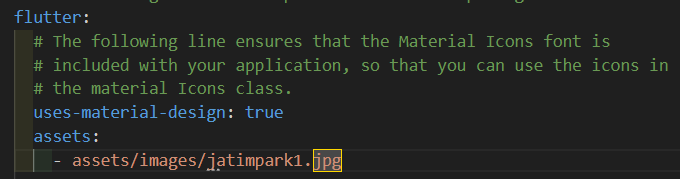
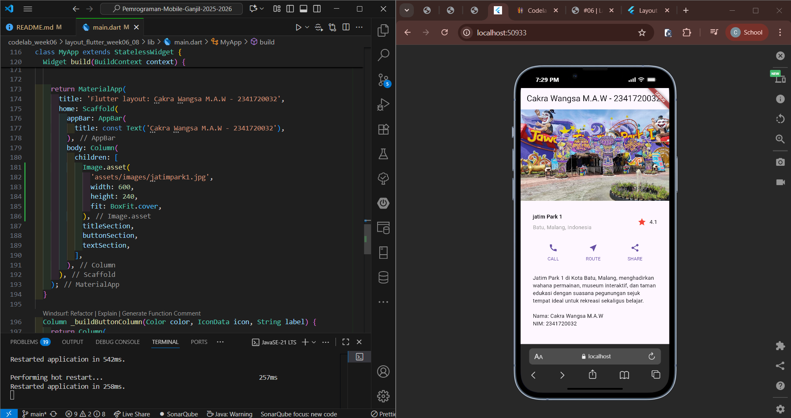

<p align="center">
  
</p>

<h1 align="center">LAPORAN PRAKTIKUM</h1>
<h2 align="center">JOBSHEET 06</h2>
<h3 align="center">Konsep Layout Flutter</h3>

---

<div align="center">

### **Dosen Pembimbing**
**Habibie Ed Dien, S.Kom., M.T.**

---

### **Disusun oleh**
**Nama**  : Cakra Wangsa M.A.W


**NIM**   : 2341720032


**Kelas** : TI-3G


**Program Studi** : D-4 Teknik Informatika

---

### **Alamat Kampus**
Politeknik Negeri Malang
Jl. Soekarno Hatta No.9, Jatimulyo, Kec. Lowokwaru, Kota Malang, Jawa Timur 65141
**Phone** : (0341) 404424, 404425
**Email** : [Polinema.ac.id](https://www.polinema.ac.id)

</div>

---

#  Praktikum 1: Membangun Layout di Flutter

## Langkah 1: Buat Project Baru
Buatlah sebuah project flutter baru dengan nama layout_flutter. Atau sesuaikan style laporan praktikum yang Anda buat.


## Langkah 2: Buka file lib/main.dart
Buka file main.dart lalu ganti dengan kode berikut. Isi nama dan NIM Anda di text title.


# Langkah 3: Identifikasi Layout Diagram

## Elemen besar (top-down)

* Root: `ListView` (bertindak sebagai kolom vertikal)
  1. `Image` (header, `height: 240`, `fit: BoxFit.cover`)
  2. **Title section** → `Padding(16)` → `Row(...)`
  3. **Button section** → `Padding(h:24, v:8)` → `Row(...)`
  4. **Text section** → `Padding(24)` → `Text(_desc)`

---

### 1. Identifikasi baris & kolom

**Title section** = `Row` (3 anak):
  * `Expanded(Column)` menghasilkan 2 teks:
  * Judul: `Text('Oeschinen Lake Campground', bold)`
  * Subjudul: `Text('Kandersteg, Switzerland', color: black54)`
  * `Icon(Icons.star, color: red)`
  * `Text('41')`
  * disini `Expanded` membuat kolom teks dengan mengambil sisa ruang sehingga ikon bintang dan angka terdorong ke kanan.

**Button section** = `Row` (3 anak):
  * Masing-masing row (anak) adalah `Column(mainAxisSize: min)` yang berisi:
  * `Icon(...)` (berwarna **primary/blue**)
  * `SizedBox(height: 8)`
  * `Text(label, color: primary, fontWeight: w600)`
  * menggunakan `mainAxisAlignment: spaceEvenly` agar ketiganya dapat tersebar rata.

---

### 2. Apakah menyertakan grid?

  **Tidak.** Karena Tidak ada `GridView`; dan hanya kombinasi `Row` + `Column`.

---

### 3. Apakah ada elemen tumpang tindih?

**Tidak.** Tidak ada `Stack/Positioned`, jadi tidak ada tumpah tindih pada elemen.

---

### 4. Apakah UI memerlukan tab?

**Tidak.** karena tidak menggunakan `TabBar/TabBarView`.

---

### 5. Alignment, padding, borders

**Alignment**
* Title: `crossAxisAlignment: CrossAxisAlignment.start` pada kolom teks; `Expanded` menekan ikon bintang dan angka ke sisi kanan baris.
* Buttons: `mainAxisAlignment: MainAxisAlignment.spaceEvenly` pada `Row`.

**Padding**
  * Title: `EdgeInsets.all(16)`
  * Buttons: `EdgeInsets.symmetric(horizontal: 24, vertical: 8)`
  * Text: `EdgeInsets.all(24)`

**Borders**
  * **Tidak ada** border/kartu. (Jika diperlukan styling, bisa bungkus dengan `Card` atau `Container(decoration: BoxDecoration(...))`.)

---


## Langkah 4: Implementasi title row
Pertama, Anda akan membuat kolom bagian kiri pada judul. Tambahkan kode berikut di bagian atas metode build() di dalam kelas MyApp:

1. Letakkan widget Column di dalam widget Expanded agar menyesuaikan ruang yang tersisa di dalam widget Row. Tambahkan properti crossAxisAlignment ke CrossAxisAlignment.start sehingga posisi kolom berada di awal baris.

    ```dart
    Expanded(
    // soal 1: Column di dalam Expanded + crossAxisAlignment.start
        child: Column(
          crossAxisAlignment: CrossAxisAlignment.start,
          children: [
    ```

2. Letakkan baris pertama teks di dalam Container sehingga memungkinkan Anda untuk menambahkan padding = 8. Teks ‘Batu, Malang, Indonesia' di dalam Column, set warna menjadi abu-abu.

    ```dart
    // soal 2: baris pertama di dalam Container dengan bottom padding 8
    Container(
    padding: const EdgeInsets.only(bottom: 8),
    child: const Text(
      'Jawa Timur Park 1',
        style: TextStyle(
        fontWeight: FontWeight.bold,
              ),
            ),
        ),
    // soal 2: baris kedua warna abu-abu
    const Text(
    'Batu, Malang, Indonesia',
    style: TextStyle(color: Colors.grey),
            ),
          ],
        ),
      ),
    ```


3. Dua item terakhir di baris judul adalah ikon bintang, set dengan warna merah, dan teks "41". Seluruh baris ada di dalam Container dan beri padding di sepanjang setiap tepinya sebesar 32 piksel. Kemudian ganti isi body text ‘Hello World' dengan variabel titleSection seperti berikut:

    ```dart
    // soal 3: ikon bintang merah + teks "41"
              const Icon(Icons.star, color: Colors.red),
              const SizedBox(width: 8),
              const Text('4.1'),
            ],
          ),
        );

        return MaterialApp(
          title: 'Flutter layout: Cakra Wangsa M.A.W - 2341720032',
          home: Scaffold(
            appBar: AppBar(
              title: const Text('Cakra Wangsa M.A.W - 2341720032'),
            ),
            // Ganti 'Hello World' dengan titleSection
            body: titleSection,
          ),
        );
      }
    }
    ```


# Praktikum 2: Implementasi button row

## Langkah 1: Buat method Column _buildButtonColumn

Bagian tombol berisi 3 kolom yang menggunakan tata letak yang sama—sebuah ikon di atas baris teks. Kolom pada baris ini diberi jarak yang sama, dan teks serta ikon diberi warna primer.

Karena kode untuk membangun setiap kolom hampir sama, buatlah metode pembantu pribadi bernama buildButtonColumn(), yang mempunyai parameter warna, Icon dan Text, sehingga dapat mengembalikan kolom dengan widgetnya sesuai dengan warna tertentu.

lib/main.dart (_buildButtonColumn)

```dart
class MyApp extends StatelessWidget {
  const MyApp({super.key});

  @override
  Widget build(BuildContext context) {
    // ···
  }

  Column _buildButtonColumn(Color color, IconData icon, String label) {
    return Column(
      mainAxisSize: MainAxisSize.min,
      mainAxisAlignment: MainAxisAlignment.center,
      children: [
        Icon(icon, color: color),
        Container(
          margin: const EdgeInsets.only(top: 8),
          child: Text(
            label,
            style: TextStyle(
              fontSize: 12,
              fontWeight: FontWeight.w400,
              color: color,
            ),
          ),
        ),
      ],
    );
  }
}
```


## Langkah 2: Buat widget buttonSection
Buat Fungsi untuk menambahkan ikon langsung ke kolom. Teks berada di dalam Container dengan margin hanya di bagian atas, yang memisahkan teks dari ikon.

Bangun baris yang berisi kolom-kolom ini dengan memanggil fungsi dan set warna, Icon, dan teks khusus melalui parameter ke kolom tersebut. Sejajarkan kolom di sepanjang sumbu utama menggunakan MainAxisAlignment.spaceEvenly untuk mengatur ruang kosong secara merata sebelum, di antara, dan setelah setiap kolom. Tambahkan kode berikut tepat di bawah deklarasi titleSection di dalam metode build():

lib/main.dart (buttonSection)

```dart
Color color = Theme.of(context).primaryColor;

Widget buttonSection = Row(
  mainAxisAlignment: MainAxisAlignment.spaceEvenly,
  children: [
    _buildButtonColumn(color, Icons.call, 'CALL'),
    _buildButtonColumn(color, Icons.near_me, 'ROUTE'),
    _buildButtonColumn(color, Icons.share, 'SHARE'),
  ],
);
```


## Langkah 3: Tambah button section ke body
Tambahkan variabel buttonSection ke dalam body seperti berikut:


# Praktikum 3: Implementasi text section

## Langkah 1: Buat widget textSection
Tentukan bagian teks sebagai variabel. Masukkan teks ke dalam Container dan tambahkan padding di sepanjang setiap tepinya. Tambahkan kode berikut tepat di bawah deklarasi buttonSection:


## Langkah 2: Tambahkan variabel text section ke body
Tambahkan widget variabel textSection ke dalam body seperti berikut:


# Praktikum 4: Implementasi image section
Selesaikan langkah-langkah praktikum berikut ini dengan melanjutkan dari praktikum sebelumnya.

## Langkah 1: Siapkan aset gambar
Anda dapat mencari gambar di internet yang ingin ditampilkan. Buatlah folder images di root project layout_flutter. Masukkan file gambar tersebut ke folder images, lalu set nama file tersebut ke file pubspec.yaml seperti berikut:



## Langkah 2: Tambahkan gambar ke body
Tambahkan aset gambar ke dalam body seperti berikut:



BoxFit.cover memberi tahu kerangka kerja bahwa gambar harus sekecil mungkin tetapi menutupi seluruh kotak rendernya.

## Langkah 3: Terakhir, ubah menjadi ListView
Pada langkah terakhir ini, atur semua elemen dalam ListView, bukan Column, karena ListView mendukung scroll yang dinamis saat aplikasi dijalankan pada perangkat yang resolusinya lebih kecil.


# Tugas Praktikum 1

1. Selesaikan Praktikum 1 sampai 4, lalu dokumentasikan dan push ke repository Anda berupa screenshot setiap hasil pekerjaan beserta penjelasannya di file README.md!

2. Silakan implementasikan di project baru "basic_layout_flutter" dengan mengakses sumber ini: https://docs.flutter.dev/codelabs/layout-basics

3. Kumpulkan link commit repository GitHub Anda kepada dosen yang telah disepakati!

# Praktikum 5: Membangun Navigasi di Flutter

Pada praktikum 5 ini anda akan belajar mengenai pembangunan aplikasi bergerak multi halaman. Aplikasi yang dikembangkan berupa kasus daftar barang belanja. Pada aplikasi ini anda akan belajar untuk berpindah halaman dan mengirimkan data ke halaman lainnya. Gambaran mockup hasil akhir aplikasi dapat anda lihat pada gambar di atas (mockup dibuat sederhana, sehingga Anda mempunyai banyak ruang untuk berkreasi). Desain aplikasi menampilkan sebuah ListView widget yang datanya bersumber dari List. Ketika item ditekan, data akan dikirimkan ke halaman berikutnya.

## Langkah 1: Siapkan project baru

Sebelum melanjutkan praktikum, buatlah sebuah project baru Flutter dengan nama belanja dan susunan folder seperti pada gambar berikut. Penyusunan ini dimaksudkan untuk mengorganisasi kode dan widget yang lebih mudah.


## Langkah 2: Mendefinisikan Route

Buatlah dua buah file dart dengan nama home_page.dart dan item_page.dart pada folder pages. Untuk masing-masing file, deklarasikan class HomePage pada file home_page.dart dan ItemPage pada item_page.dart. Turunkan class dari StatelessWidget. Gambaran potongan kode dapat anda lihat sebagai berikut.

### File home_page.dart

```dart
import 'package:flutter/material.dart';
import 'item_page.dart';

class HomePage extends StatelessWidget {
  const HomePage({super.key});

  @override
  Widget build(BuildContext context) {
    return Scaffold(
      appBar: AppBar(title: const Text('Home Page')),
      body: Center(
        child: ElevatedButton.icon(
          onPressed: () {
            Navigator.of(context).push(
              MaterialPageRoute(builder: (_) => const ItemPage()),
            );
          },
          icon: const Icon(Icons.arrow_forward),
          label: const Text('Go to Item Page'),
        ),
      ),
    );
  }
}
```

### File item_page.dart

```dart
import 'package:flutter/material.dart';

class ItemPage extends StatelessWidget {
  const ItemPage({super.key});

  @override
  Widget build(BuildContext context) {
    return Scaffold(
      appBar: AppBar(title: const Text('Item Page')),
      body: const Center(
        child: Text('This is the Item Page'),
      ),
    );
  }
}
```

## Langkah 3: Lengkapi Kode di main.dart
Setelah kedua halaman telah dibuat dan didefinisikan, bukalah file main.dart. Pada langkah ini anda akan mendefinisikan Route untuk kedua halaman tersebut. Definisi penamaan route harus bersifat unique. Halaman HomePage didefinisikan sebagai /. Dan halaman ItemPage didefinisikan sebagai /item. Untuk mendefinisikan halaman awal, anda dapat menggunakan named argument initialRoute. Gambaran tahapan ini, dapat anda lihat pada potongan kode berikut.

```dart
import 'package:flutter/material.dart';
import 'pages/home_page.dart';
import 'pages/item_page.dart';

void main() {
  runApp(const MyApp());
}

class MyApp extends StatelessWidget {
  const MyApp({super.key});

  @override
  Widget build(BuildContext context) {
    return MaterialApp(
      debugShowCheckedModeBanner: false,
      title: 'Flutter Demo',
      theme: ThemeData(
        colorScheme: ColorScheme.fromSeed(seedColor: Colors.deepPurple),
        useMaterial3: true,
      ),
      initialRoute: '/',
      routes: {
        '/': (context) => const HomePage(),
        '/item': (context) => const ItemPage(),
      },
    );
  }
}
```

## Langkah 4: Membuat data model
Sebelum melakukan perpindahan halaman dari HomePage ke ItemPage, dibutuhkan proses pemodelan data. Pada desain mockup, dibutuhkan dua informasi yaitu nama dan harga. Untuk menangani hal ini, buatlah sebuah file dengan nama item.dart dan letakkan pada folder models. Pada file ini didefinisikan pemodelan data yang dibutuhkan. Ilustrasi kode yang dibutuhkan, dapat anda lihat pada potongan kode berikut.

```dart
class Item {
  String name;
  int price;

  Item({this.name, this.price});
}
```

## Langkah 5: Lengkapi kode di class HomePage
Pada halaman HomePage terdapat ListView widget. Sumber data ListView diambil dari model List dari object Item. Gambaran kode yang dibutuhkan untuk melakukan definisi model dapat anda lihat sebagai berikut.

```dart
class HomePage extends StatelessWidget {
  HomePage({super.key});

  // Sumber data ListView dari model Item
  final List<Item> items = const [
    Item(name: 'Sugar', price: 5000),
    Item(name: 'Salt',  price: 2000),
    Item(name: 'Coffee', price: 15000),
    Item(name: 'Tea',    price: 8000),
  ];
```

## Langkah 6: Membuat ListView dan itemBuilder
Untuk menampilkan ListView pada praktikum ini digunakan itemBuilder. Data diambil dari definisi model yang telah dibuat sebelumnya. Untuk menunjukkan batas data satu dan berikutnya digunakan widget Card. Kode yang telah umum pada bagian ini tidak ditampilkan. Gambaran kode yang dibutuhkan dapat anda lihat sebagai berikut.

### Jalankan aplikasi pada emulator atau pada device anda.


## Langkah 7: Menambahkan aksi pada ListView

Item pada ListView saat ini ketika ditekan masih belum memberikan aksi tertentu. Untuk menambahkan aksi pada ListView dapat digunakan widget InkWell atau GestureDetector. Perbedaan utamanya InkWell merupakan material widget yang memberikan efek ketika ditekan. Sedangkan GestureDetector bersifat umum dan bisa juga digunakan untuk gesture lain selain sentuhan. Pada praktikum ini akan digunakan widget InkWell.

Untuk menambahkan sentuhan, letakkan cursor pada widget pembuka Card. Kemudian gunakan shortcut quick fix dari VSCode (Ctrl + . pada Windows atau Cmd + . pada MacOS). Sorot menu wrap with widget... Ubah nilai widget menjadi InkWell serta tambahkan named argument onTap yang berisi fungsi untuk berpindah ke halaman ItemPage. Ilustrasi potongan kode dapat anda lihat pada potongan berikut.

```dart
return Card(
  child: InkWell(
    onTap: () {
  // ke ItemPage via named route + kirim data
  Navigator.pushNamed(context, '/item', arguments: item);
  },
```

### Output Akhir

#### Tampilan HomePage


#### Tampilan ItemPage

