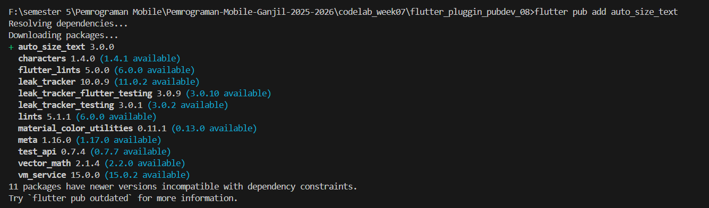
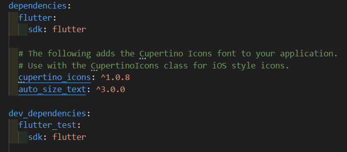
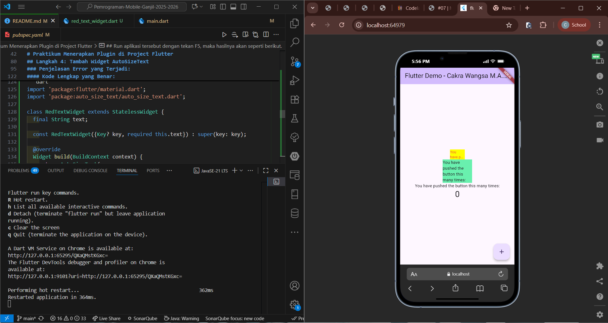

<p align="center">
  
</p>

<h1 align="center">LAPORAN PRAKTIKUM</h1>
<h2 align="center">JOBSHEET 07</h2>
<h3 align="center">Manajemen Plugin Flutter</h3>

---

<div align="center">

### **Dosen Pembimbing**

**Habibie Ed Dien, S.Kom., M.T.**

---

### **Disusun oleh**

**Nama** : Cakra Wangsa M.A.W

**NIM** : 2341720032

**Kelas** : TI-3G

**Program Studi** : D-4 Teknik Informatika

---

### **Alamat Kampus**

Politeknik Negeri Malang
Jl. Soekarno Hatta No.9, Jatimulyo, Kec. Lowokwaru, Kota Malang, Jawa Timur 65141
**Phone** : (0341) 404424, 404425
**Email** : [Polinema.ac.id](https://www.polinema.ac.id)

</div>

---

# Praktikum Menerapkan Plugin di Project Flutter

---

## Langkah 1: Buat Project Baru

Buatlah sebuah project flutter baru dengan nama flutter_plugin_pubdev. Lalu jadikan repository di GitHub Anda dengan nama flutter_plugin_pubdev.

## Langkah 2: Menambahkan Plugin

Tambahkan plugin auto_size_text menggunakan perintah berikut di terminal

```dart
flutter pub add auto_size_text
```

Jika berhasil, maka akan tampil nama plugin beserta versinya di file pubspec.yaml pada bagian dependencies.




## Langkah 3: Buat file red_text_widget.dart

Buat file baru bernama red_text_widget.dart di dalam folder lib lalu isi kode seperti berikut.

```dart
import 'package:flutter/material.dart';

class RedTextWidget extends StatelessWidget {
  const RedTextWidget({Key? key}) : super(key: key);

  @override
  Widget build(BuildContext context) {
    return Container();
  }
}
```

## Langkah 4: Tambah Widget AutoSizeText

Masih di file red_text_widget.dart, untuk menggunakan plugin auto_size_text, ubahlah kode return Container() menjadi seperti berikut.

```dart
return AutoSizeText(
      text,
      style: const TextStyle(color: Colors.red, fontSize: 14),
      maxLines: 2,
      overflow: TextOverflow.ellipsis,
);
```

Setelah Anda menambahkan kode di atas, Anda akan mendapatkan info error. Mengapa demikian? Jelaskan dalam laporan praktikum Anda!

### Penjelasan Error yang Terjadi:

Setelah menambahkan kode AutoSizeText, akan muncul **dua error utama**:

#### 1. **Error: "The method 'AutoSizeText' isn't defined"**

- **Penyebab**: Widget `AutoSizeText` belum di-import ke dalam file
- **Perbaikan**: Perlu menambahkan import statement untuk plugin auto_size_text:

```dart
import 'package:auto_size_text/auto_size_text.dart';
```

#### 2. **Error: "Undefined name 'text'"**

- **Penyebab**: Parameter `text` tidak didefinisikan dalam widget ini
- **Perbaikan**: Perlu menambahkan parameter `text` ke dalam constructor widget:

```dart
class RedTextWidget extends StatelessWidget {
  final String text;

  const RedTextWidget({Key? key, required this.text}) : super(key: key);
  // ...
}
```

#### Kode Lengkap yang Benar:

```dart
import 'package:flutter/material.dart';
import 'package:auto_size_text/auto_size_text.dart';

class RedTextWidget extends StatelessWidget {
  final String text;

  const RedTextWidget({Key? key, required this.text}) : super(key: key);

  @override
  Widget build(BuildContext context) {
    return AutoSizeText(
      text,
      style: const TextStyle(color: Colors.red, fontSize: 14),
      maxLines: 2,
      overflow: TextOverflow.ellipsis,
    );
  }
}
```

**Jadi, Error terjadi karena:**

1. **Missing Import**: Plugin `auto_size_text` belum di-import
2. **Undefined Variable**: Parameter `text` tidak didefinisikan dalam scope widget
3. **Incomplete Widget Structure**: Widget tidak memiliki cara untuk menerima data text dari parent widget

## Langkah 5: Buat Variabel text dan parameter di constructor

Tambahkan variabel text dan parameter di constructor seperti berikut.

```dart
final String text;

const RedTextWidget({Key? key, required this.text}) : super(key: key);
```

## Langkah 6: Tambahkan widget di main.dart

Buka file main.dart lalu tambahkan di dalam children: pada class \_MyHomePageState

```dart
Container(
   color: Colors.yellowAccent,
   width: 50,
   child: const RedTextWidget(
             text: 'You have pushed the button this many times:',
          ),
),
Container(
    color: Colors.greenAccent,
    width: 100,
    child: const Text(
           'You have pushed the button this many times:',
          ),
),
```

## Run aplikasi tersebut dengan tekan F5, maka hasilnya akan seperti berikut.



# Tugas Praktikum

1. Selesaikan Praktikum tersebut, lalu dokumentasikan dan push ke repository Anda berupa screenshot hasil pekerjaan beserta penjelasannya di file README.md!

   Jawab: Selesai

2. Jelaskan maksud dari langkah 2 pada praktikum tersebut!

   **Jawab:**

   Langkah 2 bertujuan untuk **menambahkan plugin external** ke dalam project Flutter. Dengan menjalankan perintah `flutter pub add auto_size_text`, kita:

   - **Mengunduh dan menginstal** plugin `auto_size_text` dari pub.dev (repository resmi package Dart/Flutter)
   - **Menambahkan dependency** secara otomatis ke file `pubspec.yaml` pada bagian `dependencies`
   - **Mengunduh package** dan dependencies yang diperlukan ke dalam project
   - **Memungkinkan import** dan penggunaan widget `AutoSizeText` dalam kode Flutter

   Plugin `auto_size_text` berfungsi untuk membuat text yang dapat **menyesuaikan ukuran font secara otomatis** berdasarkan ruang yang tersedia, sehingga text tidak akan terpotong atau overflow.

3. Jelaskan maksud dari langkah 5 pada praktikum tersebut!

   **Jawab:**

   Langkah 5 bertujuan untuk **memperbaiki error** yang terjadi pada langkah 4 dengan cara:

   - **Menambahkan variabel instance** `final String text;` untuk menyimpan data text yang akan ditampilkan
   - **Mengubah constructor** menjadi `const RedTextWidget({Key? key, required this.text})` agar widget dapat menerima parameter text dari parent widget
   - **Membuat widget reusable** yang dapat menerima input text yang berbeda-beda
   - **Menerapkan prinsip composition** dalam Flutter dimana widget dapat dikonfigurasi melalui parameter

   Tanpa langkah ini, widget `RedTextWidget` tidak akan bisa menerima data dari luar dan akan selalu menampilkan error "Undefined name 'text'".

4. Pada langkah 6 terdapat dua widget yang ditambahkan, jelaskan fungsi dan perbedaannya!

   **Jawab:**

   Dua widget yang ditambahkan memiliki fungsi dan perbedaan sebagai berikut:

   **Container Pertama (Kuning dengan RedTextWidget):**

   - **Warna background**: `Colors.yellowAccent`
   - **Lebar**: 50 pixels (sangat sempit)
   - **Child widget**: `RedTextWidget` yang menggunakan `AutoSizeText`
   - **Fungsi**: Mendemonstrasikan kemampuan auto-sizing text
   - **Behavior**: Text akan **menyesuaikan ukuran font** agar muat dalam container sempit, dan akan berwarna merah

   **Container Kedua (Hijau dengan Text):**

   - **Warna background**: `Colors.greenAccent`
   - **Lebar**: 100 pixels (lebih lebar)
   - **Child widget**: `Text` widget standar Flutter
   - **Fungsi**: Sebagai pembanding dengan widget Text biasa
   - **Behavior**: Text akan **terpotong atau overflow** jika tidak muat, menggunakan styling default

   **Perbedaan dari kedua container**: Container pertama akan menyesuaikan ukuran font secara otomatis, sedangkan container kedua akan menampilkan text overflow jika terlalu panjang.

5. Jelaskan maksud dari tiap parameter yang ada di dalam plugin auto_size_text berdasarkan tautan pada dokumentasi ini !

   **Jawab:**

   Berdasarkan kode yang digunakan dalam praktikum, parameter-parameter `AutoSizeText` adalah:

   - **`text`** (parameter pertama):

     - **Fungsi**: String yang akan ditampilkan
     - **Tipe**: String (required)
     - **Contoh**: `'You have pushed the button this many times:'`

   - **`style`**:

     - **Fungsi**: Mengatur styling text seperti warna, ukuran font, font family, dll.
     - **Tipe**: TextStyle
     - **Contoh**: `TextStyle(color: Colors.red, fontSize: 14)`
     - **Note**: fontSize di sini adalah ukuran maksimum, akan diperkecil otomatis jika perlu

   - **`maxLines`**:

     - **Fungsi**: Membatasi jumlah baris maksimum yang dapat ditampilkan
     - **Tipe**: int
     - **Contoh**: `2` (maksimal 2 baris)
     - **Behavior**: Jika text terlalu panjang, akan dipotong sesuai maxLines

   - **`overflow`**:
     - **Fungsi**: Menentukan bagaimana menangani text yang melebihi batas
     - **Tipe**: TextOverflow
     - **Contoh**: `TextOverflow.ellipsis` (menambahkan "..." di akhir text yang terpotong)
     - **Opsi lain**: `TextOverflow.clip`, `TextOverflow.fade`, `TextOverflow.visible`

6. Kumpulkan laporan praktikum Anda berupa link repository GitHub kepada dosen!
