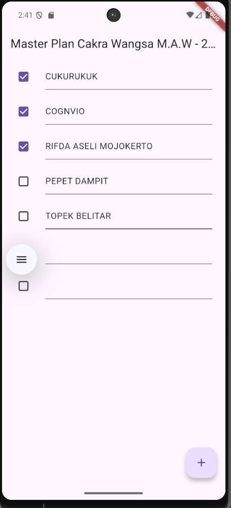
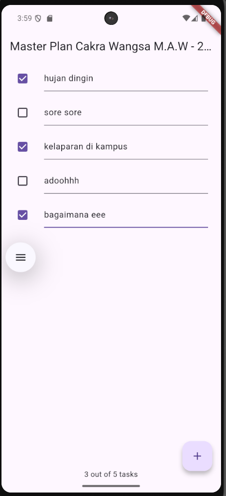
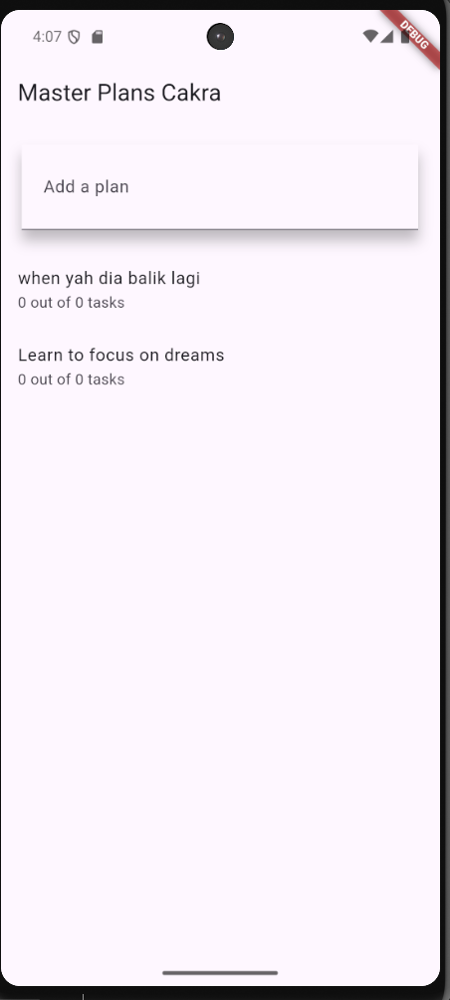
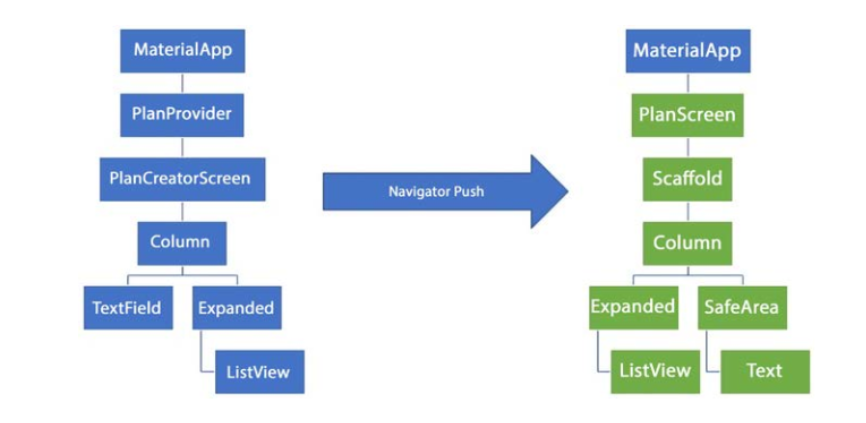

<p align="center">
  
</p>

<h1 align="center">LAPORAN PRAKTIKUM</h1>
<h2 align="center">JOBSHEET 10</h2>
<h3 align="center">Dasar State Management Flutter</h3>

---

<div align="center">

### **Dosen Pembimbing**

**Habibie Ed Dien, S.Kom., M.T.**

---

### **Disusun oleh**

**Nama** : Cakra Wangsa M.A.W

**NIM** : 2341720032

**Kelas** : TI-3G

**Program Studi** : D-4 Teknik Informatika

---

### **Alamat Kampus**

Politeknik Negeri Malang
Jl. Soekarno Hatta No.9, Jatimulyo, Kec. Lowokwaru, Kota Malang, Jawa Timur 65141
**Phone** : (0341) 404424, 404425
**Email** : [Polinema.ac.id](https://www.polinema.ac.id)

</div>

---

### Praktikum 1: Dasar State dengan Model-View

## Langkah 1: Buat Project Baru

Buatlah sebuah project flutter baru dengan nama master_plan di folder src week-10 repository GitHub Anda atau sesuai style laporan praktikum yang telah disepakati. Lalu buatlah susunan folder dalam project seperti gambar berikut ini.

## Langkah 2: Membuat model task.dart

Praktik terbaik untuk memulai adalah pada lapisan data (data layer). Ini akan memberi Anda gambaran yang jelas tentang aplikasi Anda, tanpa masuk ke detail antarmuka pengguna Anda. Di folder model, buat file bernama task.dart dan buat class Task. Class ini memiliki atribut description dengan tipe data String dan complete dengan tipe data Boolean, serta ada konstruktor. Kelas ini akan menyimpan data tugas untuk aplikasi kita. Tambahkan kode berikut:

```dart
class Task {
  final String description;
  final bool complete;

  const Task({
    this.complete = false,
    this.description = '',
  });
}
```

## Langkah 3: Buat file plan.dart

Kita juga perlu sebuah List untuk menyimpan daftar rencana dalam aplikasi to-do ini. Buat file plan.dart di dalam folder models dan isi kode seperti berikut.

```dart
import './task.dart';

class Plan {
  final String name;
  final List<Task> tasks;

  const Plan({this.name = '', this.tasks = const []});
}
```

### Langkah 4: Buat file data_layer.dart

Kita dapat membungkus beberapa data layer ke dalam sebuah file yang nanti akan mengekspor kedua model tersebut. Dengan begitu, proses impor akan lebih ringkas seiring berkembangnya aplikasi. Buat file bernama data_layer.dart di folder models. Kodenya hanya berisi export seperti berikut.

```dart
export 'plan.dart';
export 'task.dart';
```

### Langkah 5: Pindah ke file main.dart

Hapus semua kode yang ada di dalam `main.dart` dan ganti dengan kode ini

```dart
import 'package:flutter/material.dart';
import './views/plan_screen.dart';

void main() => runApp(MasterPlanApp());

class MasterPlanApp extends StatelessWidget {
  const MasterPlanApp({super.key});

  @override
  Widget build(BuildContext context) {
    return MaterialApp(
     theme: ThemeData(primarySwatch: Colors.purple),
     home: PlanScreen(),
    );
  }
}
```

### Langkah 6: buat plan_screen.dart

Pada folder views, buatlah sebuah file plan_screen.dart dan gunakan templat StatefulWidget untuk membuat class PlanScreen. Isi kodenya adalah sebagai berikut. Gantilah teks ‘Namaku' dengan nama panggilan Anda pada title AppBar.

```dart
import '../models/data_layer.dart';
import 'package:flutter/material.dart';

class PlanScreen extends StatefulWidget {
  const PlanScreen({super.key});

  @override
  State createState() => _PlanScreenState();
}

class _PlanScreenState extends State<PlanScreen> {
  Plan plan = const Plan();

  @override
  Widget build(BuildContext context) {
   return Scaffold(

    appBar: AppBar(title: const Text('Master Plan Muhammad Rifda Musyaffa')),
    body: _buildList(),
    floatingActionButton: _buildAddTaskButton(),
   );
  }
}
```

### Langkah 7: buat method \_buildAddTaskButton()

Anda akan melihat beberapa error di langkah 6, karena method yang belum dibuat. Ayo kita buat mulai dari yang paling mudah yaitu tombol Tambah Rencana. Tambah kode berikut di bawah method build di dalam class \_PlanScreenState.

```dart
Widget _buildAddTaskButton() {
    return FloatingActionButton(
     child: const Icon(Icons.add),
     onPressed: () {
       setState(() {
        plan = Plan(
         name: plan.name,
         tasks: List<Task>.from(plan.tasks)
         ..add(const Task()),
       );
      });
     },
    );
  }
```

### Langkah 8: buat widget \_buildList()

Kita akan buat widget berupa List yang dapat dilakukan scroll, yaitu ListView.builder. Buat widget ListView seperti kode berikut ini.

```dart
Widget _buildList() {
    return ListView.builder(
     itemCount: plan.tasks.length,
     itemBuilder: (context, index) =>
     _buildTaskTile(plan.tasks[index], index),
    );
  }
```

### Langkah 9: buat widget \_buildTaskTile

Dari langkah 8, kita butuh ListTile untuk menampilkan setiap nilai dari plan.tasks. Kita buat dinamis untuk setiap index data, sehingga membuat view menjadi lebih mudah. Tambahkan kode berikut ini

```dart
Widget _buildTaskTile(Task task, int index) {
    return ListTile(
      leading: Checkbox(
          value: task.complete,
          onChanged: (selected) {
            setState(() {
              plan = Plan(
                name: plan.name,
                tasks: List<Task>.from(plan.tasks)
                  ..[index] = Task(
                    description: task.description,
                    complete: selected ?? false,
                  ),
              );
            });
          }),
      title: TextFormField(
        initialValue: task.description,
        onChanged: (text) {
          setState(() {
            plan = Plan(
              name: plan.name,
              tasks: List<Task>.from(plan.tasks)
                ..[index] = Task(
                  description: text,
                  complete: task.complete,
                ),
            );
          });
        },
      ),
    );
  }
```

# Langkah 10: Tambah Scroll Controller

Anda dapat menambah tugas sebanyak-banyaknya, menandainya jika sudah beres, dan melakukan scroll jika sudah semakin banyak isinya. Namun, ada salah satu fitur tertentu di iOS perlu kita tambahkan. Ketika keyboard tampil, Anda akan kesulitan untuk mengisi yang paling bawah. Untuk mengatasi itu, Anda dapat menggunakan ScrollController untuk menghapus focus dari semua TextField selama event scroll dilakukan. Pada file plan_screen.dart, tambahkan variabel scroll controller di class State tepat setelah variabel plan.

```dart
late ScrollController scrollController;
```

# Langkah 11: Tambah Scroll Listener'

Tambahkan method initState() setelah deklarasi variabel scrollController seperti kode berikut.

```dart
@override
  void initState() {
    super.initState();
    scrollController = ScrollController()
      ..addListener(() {
        FocusScope.of(context).requestFocus(FocusNode());
      });
  }
```

# Langkah 12: Tambah controller dan keyboard behavior

Tambahkan controller dan keyboard behavior pada ListView di method \_buildList seperti kode berikut ini.

```dart
return ListView.builder(
  controller: scrollController,
 keyboardDismissBehavior: Theme.of(context).platform ==
 TargetPlatform.iOS
          ? ScrollViewKeyboardDismissBehavior.onDrag
          : ScrollViewKeyboardDismissBehavior.manual,
```

# Langkah 13: Terakhir, tambah method dispose()

Terakhir, tambahkan method dispose() berguna ketika widget sudah tidak digunakan lagi.

```dart
@override
  void dispose() {
    scrollController.dispose();
    super.dispose();
  }
```

# Langkah 14: Hasil

Lakukan Hot restart (bukan hot reload) pada aplikasi Flutter Anda. Anda akan melihat tampilan akhir seperti gambar berikut. Jika masih terdapat error, silakan diperbaiki hingga bisa running.

## HASIL PRAKTIKUM 1



### Tugas Praktikum 1: Dasar State dengan Model-View

1. Selesaikan langkah-langkah praktikum tersebut, lalu dokumentasikan berupa GIF hasil akhir praktikum beserta penjelasannya di file README.md! Jika Anda menemukan ada yang error atau tidak berjalan dengan baik, silakan diperbaiki.

2. Jelaskan maksud dari langkah 4 pada praktikum tersebut! Mengapa dilakukan demikian?

3. Mengapa perlu variabel plan di langkah 6 pada praktikum tersebut? Mengapa dibuat konstanta ?

4. Lakukan capture hasil dari Langkah 9 berupa GIF, kemudian jelaskan apa yang telah Anda buat!

5. Apa kegunaan method pada Langkah 11 dan 13 dalam lifecyle state ?
6. Kumpulkan laporan praktikum Anda berupa link commit atau repository GitHub ke dosen yang telah disepakati !

**Jawaban:**

## 1. Dokumentasi Praktikum dan Perbaikan Error

DONE

---

## 2. Penjelasan Langkah 4: Implementasi `data_layer.dart`

Langkah 4 mengimplementasikan konsep **barrel file** atau **export aggregation** melalui file `data_layer.dart`. File ini berfungsi sebagai titik akses terpusat untuk seluruh model data dalam folder `models`.

**Implementasi:**

```dart
export 'plan.dart';
export 'task.dart';
```

**Alasan implementasi ini dilakukan:**

1. **Simplifikasi Import Statement**: Dengan adanya `data_layer.dart`, komponen lain dalam aplikasi cukup melakukan satu kali import (`import '../models/data_layer.dart'`) untuk mengakses semua model yang diperlukan, menggantikan multiple import statements untuk setiap model individual.

2. **Maintainability**: Ketika struktur model berkembang dengan penambahan file baru, perubahan hanya perlu dilakukan pada satu lokasi (file `data_layer.dart`), tanpa harus memodifikasi setiap file yang menggunakan model tersebut.

3. **Encapsulation**: Pendekatan ini mengikuti prinsip enkapsulasi dalam object-oriented programming, di mana detail implementasi internal (struktur folder dan nama file spesifik) disembunyikan dari konsumen API.

4. **Code Organization**: Memisahkan concern antara struktur internal (bagaimana model disimpan) dengan interface eksternal (bagaimana model diakses) menghasilkan arsitektur yang lebih bersih dan mudah dipelihara.

---

## 3. Analisis Variabel `plan` pada Langkah 6

**Fungsi Variabel `plan`:**

Variabel `plan` (`Plan plan = const Plan();`) berfungsi sebagai **state holder** utama dalam komponen `_PlanScreenState`. Variabel ini merepresentasikan data layer yang menyimpan keseluruhan informasi rencana, termasuk daftar tugas (`List<Task>`) yang ditampilkan pada user interface.

**Peran dalam State Management:**

- Berfungsi sebagai single source of truth untuk data yang ditampilkan pada layar
- Menjadi target operasi `setState()` ketika terjadi perubahan data (penambahan tugas, modifikasi deskripsi, atau perubahan status)
- Memfasilitasi reactive programming pattern di mana perubahan data otomatis memicu rebuild UI

**Alasan Penggunaan `const Plan()`:**

1. **Immutability Pattern**: Penggunaan `const` pada nilai inisialisasi (`const Plan()`) menerapkan prinsip immutability. Objek yang dibuat bersifat immutable dan compile-time constant, yang meningkatkan performa aplikasi karena Flutter dapat mengoptimalkan penggunaan memori.

2. **Default State yang Jelas**: `const Plan()` menyediakan initial state yang eksplisit dan deterministik—sebuah Plan kosong tanpa nama dan tanpa tugas. Ini memberikan starting point yang jelas sebelum ada interaksi pengguna.

3. **Value vs Reference Immutability**: Perlu dicatat bahwa keyword `const` hanya berlaku pada **nilai awal** yang di-assign, bukan pada variabel `plan` itu sendiri. Variabel `plan` tetap mutable (dapat di-reassign), yang memungkinkan state management melalui pattern berikut:

   ```dart
   setState(() {
     plan = Plan(name: ..., tasks: ...); // Membuat objek baru
   });
   ```

4. **Predictable State Flow**: Pattern ini mendorong unidirectional data flow di mana setiap perubahan state menghasilkan objek Plan baru (copy-on-write), membuat state transitions lebih eksplisit dan mudah di-debug.

---

## 4. Hasil Implementasi Langkah 9: Widget `_buildTaskTile`

**Deskripsi Fungsionalitas (untuk GIF):**

Implementasi pada Langkah 9 menghasilkan user interface dengan behavior sebagai berikut:

1. **Initial State**: Aplikasi menampilkan AppBar dengan judul "Master Plan [Nama]" dan FloatingActionButton dengan ikon tambah (+)
2. **Penambahan Tugas**: Setiap kali tombol (+) ditekan, sistem menambahkan satu baris tugas baru yang terdiri dari Checkbox (leading) dan TextFormField (title)
3. **Input Deskripsi**: Pengguna dapat mengetik deskripsi tugas pada TextFormField, dengan perubahan yang langsung tercermin pada state aplikasi
4. **Toggle Status**: Checkbox memungkinkan pengguna menandai status penyelesaian tugas dengan interaksi tap/click

**Penjelasan Teknis Implementasi:**

Method `_buildTaskTile(Task task, int index)` merupakan **widget builder function** yang menghasilkan representasi visual untuk setiap item tugas dalam bentuk `ListTile`. Komponen ini mengimplementasikan two-way data binding melalui mekanisme berikut:

1. **Checkbox Widget**:

   - Property `value` terikat pada `task.complete` untuk menampilkan state saat ini
   - Callback `onChanged` memicu `setState()` yang menghasilkan objek Plan baru dengan Task yang telah dimodifikasi pada indeks tertentu
   - Implementasi ini memastikan immutability dengan membuat copy dari list tasks sebelum melakukan modifikasi

2. **TextFormField Widget**:
   - Property `initialValue` menampilkan `task.description` yang ada
   - Callback `onChanged` mengeksekusi logic yang sama dengan Checkbox—membuat state baru dengan deskripsi yang diperbarui
   - Penggunaan spread operator (`...`) dan cascade operator (`..`) memfasilitasi immutable list manipulation

**Arsitektur State Management:**

Implementasi ini mendemonstrasikan **local state management pattern** di mana:

- Setiap user interaction menghasilkan state mutation melalui `setState()`
- State mutation tidak memodifikasi objek existing, melainkan membuat objek baru (immutable update pattern)
- Flutter framework secara otomatis mendeteksi perubahan dan melakukan selective rebuild pada widget yang terpengaruh

---

## 5. Lifecycle Methods: `initState()` dan `dispose()`

**Method `initState()` (Langkah 11):**

**Karakteristik:**

- Dipanggil tepat satu kali selama lifecycle widget, yaitu saat State object pertama kali diinisialisasi dan dimasukkan ke dalam widget tree
- Eksekusi terjadi setelah constructor namun sebelum method `build()` pertama kali dipanggil
- Pada tahap ini, `BuildContext` sudah tersedia dan dapat digunakan untuk operasi yang memerlukan context

**Fungsi dalam Praktikum:**

```dart
@override
void initState() {
  super.initState();
  scrollController = ScrollController()
    ..addListener(() {
      FocusScope.of(context).requestFocus(FocusNode());
    });
}
```

Method ini menginisialisasi `ScrollController` dan mendaftarkan event listener yang akan menghapus focus dari TextField ketika scroll event terdeteksi. Implementasi ini mengatasi masalah UX pada platform iOS di mana keyboard dapat menghalangi TextField yang berada di posisi bawah layar.

**Use Case untuk `initState()`:**

- Inisialisasi controller (ScrollController, AnimationController, TextEditingController)
- Setup subscription ke streams atau change notifiers
- Eksekusi operasi async yang diperlukan saat widget pertama kali dimuat
- Registrasi event listeners

---

**Method `dispose()` (Langkah 13):**

**Karakteristik:**

- Dipanggil saat State object akan dihapus secara permanen dari widget tree
- Merupakan lokasi yang tepat untuk melakukan cleanup operations
- Eksekusi terjadi sebelum State object di-deallocate dari memori

**Fungsi dalam Praktikum:**

```dart
@override
void dispose() {
  scrollController.dispose();
  super.dispose();
}
```

Method ini melepaskan resources yang dialokasikan oleh `ScrollController`, termasuk event listeners yang terdaftar. Pemanggilan `dispose()` pada controller mencegah memory leak yang dapat terjadi jika listener tetap aktif setelah widget dihancurkan.

**Use Case untuk `dispose()`:**

- Cleanup controller objects (memanggil `.dispose()` pada controllers)
- Unsubscribe dari streams atau listeners
- Cancel timer atau animation yang sedang berjalan
- Melepaskan resources lain yang menggunakan system memory

**Pentingnya Lifecycle Management:**

Kedua method ini merepresentasikan **resource acquisition is initialization (RAII) pattern** dalam konteks Flutter:

- `initState()`: Acquisition phase—memperoleh resources yang diperlukan
- `dispose()`: Cleanup phase—melepaskan resources untuk mencegah memory leak

Pengelolaan lifecycle yang proper memastikan:

1. **Memory Efficiency**: Resources dilepaskan ketika tidak lagi diperlukan
2. **Predictable Behavior**: State initialization dan cleanup terjadi pada waktu yang deterministik
3. **Performance**: Mencegah akumulasi zombie listeners yang dapat mengurangi performa aplikasi

---

### Praktikum 2: Mengelola Data Layer dengan InheritedWidget dan InheritedNotifier

Bagaimana seharusnya Anda mengakses data pada aplikasi?

Beberapa pilihan yang bisa dilakukan adalah meletakkan data dalam satu kelas yang sama sehingga menjadi bagian dari life cycle aplikasi Anda.

Kemudian muncul pertanyaan, bagaimana meletakkan model dalam pohon widget ? sedangkan model bukanlah widget, sehingga tidak akan tampil pada screen.

Solusi yang memungkinkan adalah menggunakan InheritedWidget. Sejauh ini kita hanya menggunakan dua jenis widget, yaitu StatelessWidget dan StatefulWidget. Kedua widget tersebut digunakan untuk layouting UI di screen. Di mana satu bersifat statis dan dinamis. Sedangkan InheritedWidget itu berbeda, ia dapat meneruskan data ke sub-widget turunannya (biasanya ketika Anda menerapkan decomposition widget). Jika dilihat dari perspektif user, itu tidak akan terlihat prosesnya (invisible). InheritedWidget dapat digunakan sebagai pintu untuk komunikasi antara view dan data layers.

Pada codelab ini, kita akan memperbarui kode dari aplikasi Master Plan dengan memisahkan data todo list ke luar class view-nya.

Setelah Anda menyelesaikan praktikum 1, Anda dapat melanjutkan praktikum 2 ini. Selesaikan langkah-langkah praktikum berikut ini menggunakan editor Visual Studio Code (VS Code) atau Android Studio atau code editor lain kesukaan Anda.

# Langkah 1: Buat file plan_provider.dart

Buat folder baru provider di dalam folder lib, lalu buat file baru dengan nama plan_provider.dart berisi kode seperti berikut.

**Kode**

```dart
import 'package:flutter/material.dart';
import '../models/data_layer.dart';

class PlanProvider extends InheritedNotifier<ValueNotifier<Plan>> {
  const PlanProvider({super.key, required Widget child, required
   ValueNotifier<Plan> notifier})
  : super(child: child, notifier: notifier);

  static ValueNotifier<Plan> of(BuildContext context) {
   return context.
    dependOnInheritedWidgetOfExactType<PlanProvider>()!.notifier!;
  }
}
```

# Langkah 2: Edit main.dart

Gantilah pada bagian atribut home dengan PlanProvider seperti berikut. Jangan lupa sesuaikan bagian impor jika dibutuhkan.

```dart
import 'package:flutter/material.dart';
import './views/plan_screen.dart';
import './provider/plan_provider.dart';
import './models/data_layer.dart';

void main() => runApp(MasterPlanApp());

class MasterPlanApp extends StatelessWidget {
  const MasterPlanApp({super.key});

  @override
  Widget build(BuildContext context) {
    return MaterialApp(
      theme: ThemeData(primarySwatch: Colors.purple),
      home: PlanProvider(
        notifier: ValueNotifier<Plan>(const Plan()),
        child: const PlanScreen(),
      ),
    );
  }
}
```

# Langkah 3: Tambah method pada model plan.dart

Tambahkan dua method di dalam model class Plan sepe
rti kode berikut.

```dart
int get completedCount => tasks
  .where((task) => task.complete)
  .length;

String get completenessMessage =>
  '$completedCount out of ${tasks.length} tasks';
```

# Langkah 4: Pindah ke PlanScreen

Edit PlanScreen agar menggunakan data dari PlanProvider. Hapus deklarasi variabel plan (ini akan membuat error). Kita akan perbaiki pada langkah 5 berikut ini.

```dart
Plan plan = const Plan(); // <-- HAPUS BARIS INI
```

# Langkah 5: Edit method \_buildAddTaskButton

Tambahkan BuildContext sebagai parameter dan gunakan PlanProvider sebagai sumber datanya. Edit bagian kode seperti berikut.

```dart
Widget _buildAddTaskButton(BuildContext context) {
  ValueNotifier<Plan> planNotifier = PlanProvider.of(context);
  return FloatingActionButton(
    child: const Icon(Icons.add),
    onPressed: () {
      Plan currentPlan = planNotifier.value;
      planNotifier.value = Plan(
        name: currentPlan.name,
        tasks: List<Task>.from(currentPlan.tasks)..add(const Task()),
      );
    },
  );
}
```

# Langkah 6: Edit method \_buildTaskTile

Tambahkan parameter BuildContext, gunakan PlanProvider sebagai sumber data. Ganti TextField menjadi TextFormField untuk membuat inisial data provider menjadi lebih mudah.

```dart
Widget _buildTaskTile(Task task, int index, BuildContext context) {
  ValueNotifier<Plan> planNotifier = PlanProvider.of(context);
  return ListTile(
    leading: Checkbox(
       value: task.complete,
       onChanged: (selected) {
         Plan currentPlan = planNotifier.value;
         planNotifier.value = Plan(
           name: currentPlan.name,
           tasks: List<Task>.from(currentPlan.tasks)
             ..[index] = Task(
               description: task.description,
               complete: selected ?? false,
             ),
         );
       }),
    title: TextFormField(
      initialValue: task.description,
      onChanged: (text) {
        Plan currentPlan = planNotifier.value;
        planNotifier.value = Plan(
          name: currentPlan.name,
          tasks: List<Task>.from(currentPlan.tasks)
            ..[index] = Task(
              description: text,
              complete: task.complete,
            ),
        );
      },
    ),
  );
}
```

# Langkah 7: Edit \_buildList

Sesuaikan parameter pada bagian \_buildTaskTile seperti kode berikut.

```dart
Widget _buildList(Plan plan) {
   return ListView.builder(
     controller: scrollController,
     itemCount: plan.tasks.length,
     itemBuilder: (context, index) =>
        _buildTaskTile(plan.tasks[index], index, context),
   );
}
```

# Langkah 8: Tetap di class PlanScreen

Edit method build sehingga bisa tampil progress pada bagian bawah (footer). Caranya, bungkus (wrap) \_buildList dengan widget Expanded dan masukkan ke dalam widget Column seperti kode pada Langkah 9.

# Langkah 9: Tambah widget SafeArea

Terakhir, tambahkan widget SafeArea dengan berisi completenessMessage pada akhir widget Column. Perhatikan kode berikut ini.

```dart
@override
Widget build(BuildContext context) {
   return Scaffold(
     appBar: AppBar(title: const Text('Master Plan')),
     body: ValueListenableBuilder<Plan>(
       valueListenable: PlanProvider.of(context),
       builder: (context, plan, child) {
         return Column(
           children: [
             Expanded(child: _buildList(plan)),
             SafeArea(child: Text(plan.completenessMessage))
           ],
         );
       },
     ),
     floatingActionButton: _buildAddTaskButton(context),
   );
}
```

**Hasil**


# 6. Tugas Praktikum 2: InheritedWidget

1. Selesaikan langkah-langkah praktikum tersebut, lalu dokumentasikan berupa GIF hasil akhir praktikum beserta penjelasannya di file README.md! Jika Anda menemukan ada yang error atau tidak berjalan dengan baik, silakan diperbaiki sesuai dengan tujuan aplikasi tersebut dibuat.

2. Jelaskan mana yang dimaksud InheritedWidget pada langkah 1 tersebut! Mengapa yang digunakan InheritedNotifier?

3. Jelaskan maksud dari method di langkah 3 pada praktikum tersebut! Mengapa dilakukan demikian?

4. Lakukan capture hasil dari Langkah 9 berupa GIF, kemudian jelaskan apa yang telah Anda buat!

5. Kumpulkan laporan praktikum Anda berupa link commit atau repository GitHub ke dosen yang telah disepakati !

**Jawaban:**

## 1. Dokumentasi Praktikum dan Perbaikan Error

## 2. Analisis InheritedWidget dan InheritedNotifier pada Langkah 1

**Identifikasi InheritedWidget:**

Pada implementasi Langkah 1, `InheritedWidget` merujuk pada class `PlanProvider` yang merupakan implementasi custom dari mekanisme inheritance widget di Flutter. Class ini secara eksplisit meng-extend `InheritedNotifier<ValueNotifier<Plan>>`, yang merupakan specialized subclass dari `InheritedWidget`.

**Hierarki Inheritance:**

```
Widget
  └─ ProxyWidget
      └─ InheritedWidget
          └─ InheritedNotifier<T extends Listenable>
              └─ PlanProvider (custom implementation)
```

**Rasionalisasi Penggunaan InheritedNotifier:**

Pemilihan `InheritedNotifier` dibandingkan `InheritedWidget` standar didasari oleh beberapa pertimbangan arsitektural:

1. **Automatic Dependency Tracking**: `InheritedNotifier` menyediakan mekanisme built-in untuk tracking dependencies antara widget tree dan Listenable object (`ValueNotifier<Plan>` dalam konteks ini). Ketika nilai pada `ValueNotifier` berubah, framework secara otomatis mengidentifikasi widget mana yang perlu di-rebuild.

2. **Reactive State Propagation**: `InheritedWidget` konvensional memerlukan mekanisme manual untuk notifikasi perubahan state melalui pemanggilan method seperti `setState()` pada parent widget. Sebaliknya, `InheritedNotifier` mengintegrasikan pattern Observer dengan memanfaatkan `Listenable` interface, memungkinkan reactive data flow yang lebih efisien.

3. **Optimized Rebuild Mechanism**: Dengan `InheritedNotifier`, hanya widget yang secara eksplisit mendeclare dependency melalui `PlanProvider.of(context)` yang akan di-rebuild ketika data berubah. Ini berbeda dengan pendekatan setState yang dapat memicu unnecessary rebuilds pada subtree yang luas.

**Mekanisme Kerja:**

1. `PlanProvider` mem-wrap `ValueNotifier<Plan>` sebagai notifier
2. Method `PlanProvider.of(context)` memberikan akses ke `ValueNotifier` melalui `dependOnInheritedWidgetOfExactType`
3. Saat `planNotifier.value` di-assign dengan nilai baru (Langkah 5 & 6), `ValueNotifier` men-trigger notification
4. Framework Flutter mendeteksi change notification dan secara selektif me-rebuild widgets yang registered sebagai listeners (melalui `ValueListenableBuilder` di Langkah 9)

**Keunggulan Arsitektural:**

Pendekatan ini mengimplementasikan **separation of concerns** di mana:

- State management logic terencapsulasi dalam Provider layer
- UI components (widgets) remain stateless atau hanya manage local UI state
- Data flow menjadi unidirectional dan predictable (top-down propagation)

---

## 3. Analisis Computed Properties pada Model Plan (Langkah 3)

**Implementasi Getter Methods:**

Langkah 3 menambahkan dua computed properties pada class `Plan`:

```dart
int get completedCount => tasks.where((task) => task.complete).length;
String get completenessMessage => '$completedCount out of ${tasks.length} tasks';
```

**Fungsi dan Tujuan:**

1. **`completedCount`**: Merupakan derived property yang melakukan aggregation terhadap collection `tasks`. Method ini mengaplikasikan filtering operation menggunakan predicate `task.complete == true`, kemudian menghitung cardinal dari hasil filter tersebut.

2. **`completenessMessage`**: Property ini berfungsi sebagai **presentation formatter** yang mengkonversi data mentah (completed count dan total count) menjadi human-readable string yang siap untuk ditampilkan pada UI layer.

**Justifikasi Arsitektural:**

Penempatan logic ini pada Model layer (class `Plan`) bukan pada View layer (`PlanScreen`) mengikuti beberapa prinsip software engineering:

**1. Single Responsibility Principle (SRP)**

- Model layer: Bertanggung jawab atas business logic dan data transformation
- View layer: Fokus pada presentational concerns dan user interaction handling
- Dengan memindahkan calculation logic ke Model, setiap layer memiliki responsibility yang terdefinisi dengan jelas

**2. Don't Repeat Yourself (DRY)**

- Logic penghitungan progress hanya didefinisikan sekali di Model
- Jika ada multiple views yang perlu menampilkan progress, mereka semua dapat menggunakan property yang sama tanpa duplikasi kode
- Perubahan pada format atau logic penghitungan hanya perlu dilakukan di satu tempat

**3. Testability**

- Business logic yang terletak di Model dapat di-unit test secara isolated tanpa dependency pada UI framework
- Testing menjadi lebih straightforward karena tidak melibatkan widget testing yang lebih complex

**4. Maintainability**

- View components menjadi "dumb" atau thin—mereka hanya render data tanpa memahami bagaimana data tersebut dihitung
- Perubahan pada business rule (misalnya: mengubah format message atau menambahkan weightage pada task completion) tidak memerlukan modifikasi pada View

**Pattern yang Diimplementasikan:**

Ini merupakan implementasi dari **Computed Properties Pattern** atau **Derived State Pattern**, di mana:

- State fundamental (`tasks` list) disimpan dalam bentuk normalized
- Derived values (completed count, message) dihitung on-demand melalui getters
- Tidak ada redundant state storage yang dapat menyebabkan inconsistency

---

## 4. Analisis Implementasi ValueListenableBuilder (Langkah 9)

**Konteks Implementasi:**

Langkah 9 merepresentasikan integrasi final dari state management architecture yang dibangun pada langkah-langkah sebelumnya. Pada tahap ini, method `build()` dari `PlanScreen` di-refactor untuk mengintegrasikan reactive UI pattern.

**Komponen Kunci yang Diimplementasikan:**

**1. ValueListenableBuilder Widget**

Widget ini merupakan **Reactive UI Component** yang mengimplementasikan Observer pattern. Karakteristik utamanya:

```dart
ValueListenableBuilder<Plan>(
  valueListenable: PlanProvider.of(context),
  builder: (context, plan, child) { ... }
)
```

- **`valueListenable`**: Reference ke `ValueNotifier<Plan>` yang di-manage oleh `PlanProvider`
- **`builder` callback**: Pure function yang menerima current value (`plan`) dan menghasilkan widget tree
- **Automatic subscription**: Widget secara otomatis subscribe ke value changes dan unsubscribe saat dispose

**2. Reactive UI Layout**

Layout yang dihasilkan mengimplementasikan **Progressive Disclosure Pattern**:

```dart
Column(
  children: [
    Expanded(child: _buildList(plan)),        // Dynamic content area
    SafeArea(child: Text(plan.completenessMessage))  // Status indicator
  ]
)
```

**Behavior dan User Experience:**

1. **Initial Render**: Aplikasi menampilkan empty list dengan progress "0 out of 0 tasks"
2. **Task Addition**: Saat user menekan FAB, task baru ditambahkan, ListView grows, progress update ke "0 out of N tasks"
3. **Task Interaction**:
   - Checkbox toggle → immediate progress update
   - Text editing → real-time description change
4. **Real-time Feedback**: Progress text di footer update instantly tanpa explicit refresh mechanism

**Optimisasi yang Dicapai:**

1. **Granular Rebuilds**: Hanya `ValueListenableBuilder` subtree yang rebuild, bukan entire widget tree
2. **Declarative Updates**: Tidak ada imperative setState calls yang tersebar di berbagai methods
3. **Separation of Concerns**: Business logic (di Model) terpisah dari presentation logic (di ValueListenableBuilder)

**Pattern yang Didemonstrasikan:**

- **Observer Pattern**: ValueListenableBuilder observes ValueNotifier
- **Reactive Programming**: UI merespons otomatis terhadap state changes
- **Unidirectional Data Flow**: Data flows dari Provider → Builder → UI (tidak ada reverse mutations)

---

# Praktikum 3: Membuat State di Multiple Screens

Satu kalimat populer atau viral yang beredar dalam komunitas Flutter adalah "Lift State Up". Mantra ini merujuk ke sebuah ide di mana objek State seharusnya berada lebih tinggi dari pada widget yang membutuhkannya di dalam sebuah widget tree. InheritedWidget yang telah kita buat sebelumnya bekerja dengan sempurna pada satu screen, tapi apa yang akan terjadi jika kita tambah screen kedua ?

Pada codelab ini, Anda akan menambah screen lain pada aplikasi Master Plan sehingga bisa membuat kelompok daftar plan lebih dari satu.

Selesaikan langkah-langkah praktikum berikut ini menggunakan editor Visual Studio Code (VS Code) atau Android Studio atau code editor lain kesukaan Anda.

Perhatian: Diasumsikan Anda telah berhasil menyelesaikan praktikum 2.

# Langkah 1: Edit PlanProvider

Perhatikan kode berikut, edit class PlanProvider sehingga dapat menangani List Plan.

```dart
import 'package:flutter/material.dart';
import '../models/data_layer.dart';

class PlanProvider extends InheritedNotifier<ValueNotifier<List<Plan>>> {
  const PlanProvider({
    super.key,
    required Widget child,
    required ValueNotifier<List<Plan>> notifier,
  }) : super(child: child, notifier: notifier);

  static ValueNotifier<List<Plan>> of(BuildContext context) {
    return context
        .dependOnInheritedWidgetOfExactType<PlanProvider>()!
        .notifier!;
  }
}
```

# Langkah 2: Edit main.dart

Langkah sebelumnya dapat menyebabkan error pada main.dart dan plan_screen.dart. Pada method build, gantilah menjadi kode seperti ini.

```dart
import 'package:flutter/material.dart';
import './provider/plan_provider.dart';
import './models/data_layer.dart';
import './views/plan_creator_screen.dart';

void main() => runApp(const MasterPlanApp());

class MasterPlanApp extends StatelessWidget {
  const MasterPlanApp({super.key});

  @override
  Widget build(BuildContext context) {

    return PlanProvider(
      notifier: ValueNotifier<List<Plan>>(const []),
      child: MaterialApp(
        title: 'State management app',
        theme: ThemeData(
          primarySwatch: Colors.blue,
        ),
        home: const PlanCreatorScreen(),
      ),
    );
  }
}
```

# Langkah 3: Edit plan_screen.dart

Tambahkan variabel plan dan atribut pada constructor-nya seperti berikut.

```dart
final Plan plan;
const PlanScreen({super.key, required this.plan});
```

# Langkah 4: Error

Itu akan terjadi error setiap kali memanggil PlanProvider.of(context). Itu terjadi karena screen saat ini hanya menerima tugas-tugas untuk satu kelompok Plan, tapi sekarang PlanProvider menjadi list dari objek plan tersebut.

# Langkah 5: Tambah getter Plan

Tambahkan getter pada \_PlanScreenState seperti kode berikut.

```dart
Plan get plan => widget.plan;
```

# Langkah 6: Method initState()

Pada bagian ini kode tetap seperti berikut.

```dart
@override
void initState() {
   super.initState();
   scrollController = ScrollController()
    ..addListener(() {
      FocusScope.of(context).requestFocus(FocusNode());
    });
}
```

# Langkah 7: Widget build

Pastikan Anda telah merubah ke List dan mengubah nilai pada currentPlan seperti kode berikut ini.

```dart
 @override
  Widget build(BuildContext context) {
    ValueNotifier<List<Plan>> plansNotifier = PlanProvider.of(context);

    return Scaffold(
      appBar: AppBar(title: Text(plan.name)),
      body: ValueListenableBuilder<List<Plan>>(
        valueListenable: plansNotifier,
        builder: (context, plans, child) {
          Plan currentPlan = plans.firstWhere((p) => p.name == plan.name);
          return Column(
            children: [
              Expanded(child: _buildList(currentPlan)),
              SafeArea(child: Text(currentPlan.completenessMessage)),
            ],
          );
        },
      ),
      floatingActionButton: _buildAddTaskButton(
        context,
      ),
    );
  }

  Widget _buildAddTaskButton(BuildContext context) {
    ValueNotifier<List<Plan>> planNotifier = PlanProvider.of(context);
    return FloatingActionButton(
      child: const Icon(Icons.add),
      onPressed: () {
        Plan currentPlan = plan;
        int planIndex =
            planNotifier.value.indexWhere((p) => p.name == currentPlan.name);

        List<Task> updatedTasks = List<Task>.from(currentPlan.tasks)
          ..add(const Task());

        planNotifier.value = List<Plan>.from(planNotifier.value)
          ..[planIndex] = Plan(
            name: currentPlan.name,
            tasks: updatedTasks,
          );
      },
    );
  }
```

# Langkah 8: Edit \_buildTaskTile

Pastikan ubah ke List dan variabel planNotifier seperti kode berikut ini.

```dart
Widget _buildTaskTile(Task task, int index, BuildContext context) {
    ValueNotifier<List<Plan>> planNotifier = PlanProvider.of(context);

    return ListTile(
      leading: Checkbox(
          value: task.complete,
          onChanged: (selected) {
            Plan currentPlan = plan;
            int planIndex = planNotifier.value
                .indexWhere((p) => p.name == currentPlan.name);

            planNotifier.value = List<Plan>.from(planNotifier.value)
              ..[planIndex] = Plan(
                name: currentPlan.name,
                tasks: List<Task>.from(currentPlan.tasks)
                  ..[index] = Task(
                    description: task.description,
                    complete: selected ?? false,
                  ),
              );
          }),
      title: TextFormField(
        initialValue: task.description,
        onChanged: (text) {
          Plan currentPlan = plan;
          int planIndex =
              planNotifier.value.indexWhere((p) => p.name == currentPlan.name);

          planNotifier.value = List<Plan>.from(planNotifier.value)
            ..[planIndex] = Plan(
              name: currentPlan.name,
              tasks: List<Task>.from(currentPlan.tasks)
                ..[index] = Task(
                  description: text,
                  complete: task.complete,
                ),
            );
        },
      ),
    );
  }
```

# Langkah 9: Buat screen baru

Pada folder view, buatlah file baru dengan nama plan_creator_screen.dart dan deklarasikan dengan StatefulWidget bernama PlanCreatorScreen. Gantilah di main.dart pada atribut home menjadi seperti berikut.

```dart
import 'package.flutter/material.dart';
import '../models/data_layer.dart';
import '../provider/plan_provider.dart';
import './plan_screen.dart';

class PlanCreatorScreen extends StatefulWidget {
  const PlanCreatorScreen({super.key});

  @override
  State<PlanCreatorScreen> createState() => _PlanCreatorScreenState();
}

class _PlanCreatorScreenState extends State<PlanCreatorScreen> {


  @override
  Widget build(BuildContext context) {
    return Scaffold(

    );
  }
}
```

# Langkah 10: Isi \_PlanCreatorScreenState

```dart
import 'package:flutter/material.dart';
import '../models/data_layer.dart';
import '../provider/plan_provider.dart';
import './plan_screen.dart';

class PlanCreatorScreen extends StatefulWidget {
  const PlanCreatorScreen({super.key});

  @override
  State<PlanCreatorScreen> createState() => _PlanCreatorScreenState();
}

class _PlanCreatorScreenState extends State<PlanCreatorScreen> {

  final textController = TextEditingController();

  @override
  void dispose() {
    textController.dispose();
    super.dispose();
  }

  // Langkah 11: Method build utama
  @override
  Widget build(BuildContext context) {
    return Scaffold(
      appBar: AppBar(title: const Text('Master Plans Rifda')),
      body: Column(children: [
        _buildListCreator(),
        Expanded(child: _buildMasterPlans())
      ]),
    );
  }

  // Langkah 12: Widget untuk TextField
  Widget _buildListCreator() {
    return Padding(
        padding: const EdgeInsets.all(20.0),
        child: Material(
          color: Theme.of(context).cardColor,
          elevation: 10,
          child: TextField(
              controller: textController,
              decoration: const InputDecoration(
                  labelText: 'Add a plan',
                  contentPadding: EdgeInsets.all(20)),
              onEditingComplete: addPlan),
        ));
  }

  // Langkah 13: Logika untuk menambah Rencana baru
  void addPlan() {
    final text = textController.text;
    if (text.isEmpty) {
      return;
    }
    final plan = Plan(name: text, tasks: []);
    ValueNotifier<List<Plan>> planNotifier = PlanProvider.of(context);

    planNotifier.value = List<Plan>.from(planNotifier.value)..add(plan);

    textController.clear();
    FocusScope.of(context).requestFocus(FocusNode());
  }

  // Langkah 14: Widget untuk menampilkan daftar Rencana (VERSI DIPERBAIKI)
  Widget _buildMasterPlans() {
    ValueNotifier<List<Plan>> planNotifier = PlanProvider.of(context);

    return ValueListenableBuilder<List<Plan>>(
      valueListenable: planNotifier,
      builder: (context, plans, child) {

        if (plans.isEmpty) {
          return Column(
              mainAxisAlignment: MainAxisAlignment.center,
              children: <Widget>[
                const Icon(Icons.note, size: 100, color: Colors.grey),
                Text('Anda belum memiliki rencana apapun.',
                    style: Theme.of(context).textTheme.headlineSmall)
              ]);
        }

        return ListView.builder(
            itemCount: plans.length,
            itemBuilder: (context, index) {
              final plan = plans[index];
              return ListTile(
                  title: Text(plan.name),
                  subtitle: Text(plan.completenessMessage),
                  onTap: () {
                    Navigator.of(context).push(MaterialPageRoute(
                        builder: (_) => PlanScreen(plan: plan)));
                  });
            });
      },
    );
  }
}
```

**Hasil**


# Tugas Praktikum 3

1. Selesaikan langkah-langkah praktikum tersebut, lalu dokumentasikan berupa GIF hasil akhir praktikum beserta penjelasannya di file README.md! Jika Anda menemukan ada yang error atau tidak berjalan dengan baik, silakan diperbaiki sesuai dengan tujuan aplikasi tersebut dibuat.

2. Berdasarkan Praktikum 3 yang telah Anda lakukan, jelaskan maksud dari gambar diagram berikut ini!



3. Lakukan capture hasil dari Langkah 14 berupa GIF, kemudian jelaskan apa yang telah Anda buat!

4. Kumpulkan laporan praktikum Anda berupa link commit atau repository GitHub ke dosen yang telah disepakati !

Jawaban

## 2. Penjelasan Diagram Widget Tree

Diagram tersebut merepresentasikan arsitektur state berbasis ambient context pada Flutter, di mana `PlanProvider` (turunan `InheritedNotifier`) ditempatkan pada level superior dalam hierarki widget. Konfigurasi ini memastikan bahwa kedua layar—`PlanCreatorScreen` dan `PlanScreen`—memiliki akses ke sumber status yang identik tanpa memerlukan propagasi parameter eksplisit melalui konstruktor.

**Analisis Arsitektural:**

1. **Cakupan Provider dan Resolusi Dependensi**: Penempatan `PlanProvider` di atas `MaterialApp` menjadikannya sebagai single source of truth bagi keseluruhan subtree aplikasi. Invokasi `PlanProvider.of(context)` melakukan dependency resolution dengan mencari provider terdekat pada pohon widget melalui mekanisme `dependOnInheritedWidgetOfExactType`, memungkinkan kedua layar berbagi state yang konsisten.

2. **Arah Aliran Data dan Peristiwa**: Data mengalir secara top–down (provider → builder → UI) melalui `ValueListenableBuilder`, sedangkan peristiwa pengguna (tap, input) mengalir bottom–up (UI → notifier). Mutasi pada `ValueNotifier<List<Plan>>` memicu notifikasi ke listener yang terdaftar, mengakibatkan rebuild selektif pada subtree yang relevan, sehingga meminimalkan biaya render global.

3. **Navigasi dan Konsistensi Identitas**: `Navigator.push` memindahkan fokus interaksi ke `PlanScreen` dengan membawa referensi rencana yang dipilih. Karena layar detail merekonsiliasi rencana melalui koleksi terkini (menggunakan `firstWhere` untuk pencarian berdasarkan nama), tampilan tetap sinkron walaupun terjadi pembaruan state setelah navigasi. Pendekatan ini memastikan referential consistency dalam konteks state management yang terdistribusi.

4. **Implikasi Desain dan Skalabilitas**: Arsitektur ini menurunkan coupling antar-layar (loose coupling), meningkatkan keterujian komponen (testability), serta mengurangi kebutuhan pengkabelan state manual (boilerplate reduction). Untuk keandalan produksi, disarankan menambahkan identitas entitas yang stabil (misal UUID untuk `Plan`) agar resolusi referensi tidak bergantung pada atribut mutable seperti nama, yang dapat berubah seiring interaksi pengguna.

**Kesimpulan**: Diagram menegaskan pemisahan kepedulian (separation of concerns) di mana provider mengelola status dan notifikasi, widget menangani presentasi dan interaksi, sementara navigator mengatur alur kontrol antar-layar dalam pola unidirectional data flow.

---

## 3. Penjelasan Langkah 14

Langkah 14 menyelesaikan komponen daftar rencana pada layar utama melalui implementasi metode `_buildMasterPlans()`. Komponen ini mengobservasi `ValueNotifier<List<Plan>>` dari `PlanProvider` dan merender koleksi secara deklaratif sesuai dengan perubahan state.

**Spesifikasi Teknis:**

1. **Kontrak Komponen dan Kriteria Sukses**: Masukan implisit berupa `BuildContext` dengan akses ke `ValueNotifier<List<Plan>>`; keluaran berupa widget yang menampilkan daftar rencana atau placeholder untuk keadaan kosong. Keberhasilan diukur dari (a) kesesuaian tampilan terhadap mutasi state secara real‑time, (b) transisi navigasi yang benar saat item dipilih, dan (c) tidak adanya memory leak atau zombie listener.

2. **Mekanisme Kerja dan Alur Eksekusi**: `ValueListenableBuilder` melakukan subscription terhadap notifier dan membangun UI reaktif berdasarkan nilai terkini. Untuk kondisi kosong (`plans.isEmpty`), komponen merender placeholder informatif (ikon dan pesan); untuk kondisi berisi, menggunakan `ListView.builder` untuk lazy rendering, sehingga hanya item dalam viewport yang di-instansiasi. Setiap `ListTile` menampilkan `plan.name` dan `completenessMessage` (computed property) serta memicu `Navigator.push` pada callback `onTap`.

3. **Rasionalisasi Desain dan Pattern**: Pendekatan berbasis observable (listenable) mengurangi imperative state update (`setState`) yang tersebar, meningkatkan granularitas rebuild (hanya subtree `ValueListenableBuilder` yang terpengaruh), dan menjaga separation of concerns antara logika data (model) dan presentasi (widget). Kompleksitas waktu untuk pembuatan daftar bersifat O(n) terhadap jumlah rencana, namun biaya render efektif dibatasi oleh jumlah item pada viewport (lazy evaluation).

4. **Pertimbangan Edge Case dan Peningkatan**: Untuk produksi, gunakan `Key` yang stabil pada item list untuk mempertahankan identitas widget saat terjadi mutasi koleksi (reordering, insertion, deletion). Terapkan ellipsis untuk nama rencana yang panjang, dan pertimbangkan penambahan ID unik pada model `Plan` untuk mencegah ketidakselarasan referensi saat nama berubah. Implementasi pengujian widget otomatis untuk skenario kosong, penambahan, dan navigasi akan memperkuat reliabilitas dan maintainability.

**Kesimpulan Implementatif**: Langkah 14 memformalkan pola antarmuka reaktif yang efisien: observasi state dari provider melalui listenable builder, rendering deklaratif dengan lazy evaluation untuk optimasi performa, dan navigasi yang konsisten terhadap single source of truth dalam arsitektur state management yang terstruktur.
